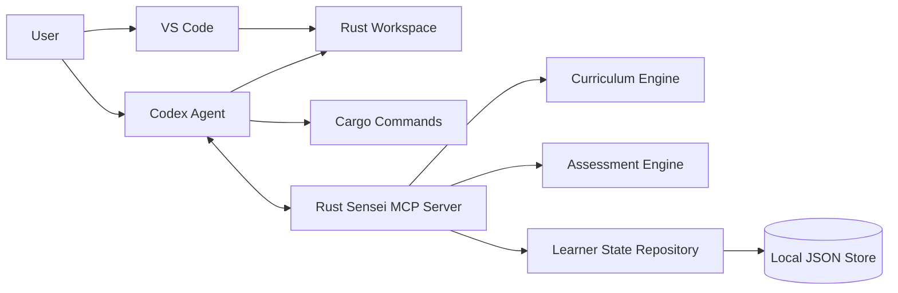

# Rust Sensei

Rust Sensei is a local-first MCP server for an adaptive Rust learning agent.

The learner writes Rust code in VS Code. Codex operates in the same workspace, calls Rust Sensei through MCP, verifies work when asked, and presents coaching feedback. Rust Sensei owns learner memory, lesson planning, assessment, progress tracking, and next-step recommendations.

## Goals

- Teach general Rust fluency before specialized tracks.
- Ask exactly 1 initial Rust placement question.
- Adapt lessons based on demonstrated work.
- Track Rust-specific skill separately from general programming skill.
- Use local JSON storage for v1 behind repository interfaces.
- Keep the MCP server agent-neutral so Codex, Claude Code, and other MCP clients can use it.
- Avoid executing arbitrary learner code inside the MCP server in v1.

## Current Status

This repository contains design documentation and a local Python v1 implementation. The core local MCP/server flow is implemented; remaining v1-release work is client setup documentation, packaging polish, and environment validation on target machines.

- Package metadata and CLI entrypoint.
- Typed DTO and domain models for session, setup, lesson assignment, curriculum, attempt submission, and assessment flows.
- JSON repositories for learner profiles, lesson assignments, curriculum seed data, attempts, assessments, and learner signals.
- Atomic JSON writes with file locking, state revision tracking, and best-effort recovery from the latest valid backup when the primary state file is unreadable.
- Session service for initial placement, active profile retrieval, and learner signal recording.
- Lesson service for first assignment selection, active assignment reuse, active-assignment abandonment, pending-assessment detection, post-assessment adaptive selection, and prerequisite-aware reopening.
- `get_next_lesson` includes agent-owned workspace suggestions for stable per-assignment paths, including generated Cargo package scaffolds for normal lessons and directory-only handling for `cargo new` project-setup lessons.
- `rust_sensei.agent_workflow.prepare_agent_lesson` composes workspace suggestions with the local workspace helper, supports caller-provided editor openers such as VS Code, and keeps generated lesson paths ready for attempt evidence.
- `rust_sensei.agent_workflow.build_submit_attempt_request` builds attempt DTOs from prepared lesson workspaces, including generated relative file paths and current lesson file contents when present. It omits absolute `workspace_root` by default unless local diagnostics explicitly opt in.
- `rust_sensei.agent_workflow.write_agent_lesson_report` writes the per-assignment report from the prepared workspace, submitted attempt evidence, and canonical assessment result.
- `examples/codex_agent_workflow.py` shows Codex-oriented client glue around the workflow helper while keeping editor control and command execution outside the MCP server.
- `rust_sensei.agent_workspace.prepare_lesson_workspace` creates or reuses the suggested local lesson directory and starter Cargo files without overwriting learner code.
- `rust_sensei.agent_report.write_lesson_report` writes a stable per-assignment Markdown report after assessment with the canonical Rust Sensei assessment embedded as JSON. Human-readable report sections redact obvious local absolute path fragments while preserving canonical assessment JSON.
- Adaptive lesson selection handlers live in `rust_sensei/domain/lesson_selection.py`, including `next_concepts` graph traversal, direct prerequisite reopening, branch target resolution, and deterministic prompt variant rotation. Deterministic scoring uses concept `completion_thresholds` to gate `continue` and `accelerate` decisions when thresholds are configured.
- Curriculum seed loading validates the current v1 shape, including nonblank required fields, known difficulty bands, unique concept order values, known rubric ids, richer concept graph metadata, valid concept references, valid branch target lists, completion thresholds, workspace artifact policies, and lesson command metadata. Invalid or unreadable custom curriculum files are returned as structured storage errors.
- Assessment service implements `submit_attempt` and an initial `assess_attempt` flow with persisted idempotent assessment records, nonblank evidence validation, strict command metadata source/risk validation, artifact size limits, truncation-reason checks, and secret-bearing path rejection.
- Deterministic rubric scoring, confidence measuring, confidence explanations, and ordered next-step rules live in `rust_sensei/domain/scoring.py`. The v1 scorer can emit high-confidence branches for repeated compiler failures and problem-solving gaps when Rust syntax evidence is strong.
- Skill model updates with confidence dampening live in `rust_sensei/domain/skill_update.py`.
- Append-only progress events are stored for assignment creation/viewing, attempt submission, assessment, adaptive assessment outcomes, prerequisite reopening, and assignment abandonment. Lifecycle events for creation, attempt submission, assessment, adaptive outcomes, prerequisite reopening, and abandonment are written in the same JSON transaction as the canonical state change.
- `start_session` records `provisionally_skipped` progress events in the same JSON transaction as profile creation when `proficient` or `expert` placement starts the learner beyond earlier concepts.
- Progress service implements `get_progress_summary` with completed/repeated/skipped concepts, recent events, recommended focus, and trend.
- Setup service for Python, rustc, Cargo, and state directory diagnostics.
- CLI diagnostics include `setup-status` JSON output and `doctor` human or JSON output.
- Daily append-only file logging under the configured state directory.
- Tests for session, lesson assignment, attempt submission, assessment, scoring, setup, JSON state behavior, and MCP handler registration.

Implemented MCP tools in code:

- `start_session`
- `get_learner_profile`
- `get_next_lesson`
- `submit_attempt`
- `assess_attempt`
- `get_progress_summary`
- `update_learner_signal`
- `get_setup_status`

Implemented MCP resources in code:

- `rust-sensei://profile/active`
- `rust-sensei://progress/summary`
- `rust-sensei://curriculum/concepts`

Implemented MCP prompts in code:

- `rust_sensei_tutor`
- `rust_sensei_attempt_review`
- `rust_sensei_stuck_coaching`

Known limitations:

- MCP handler registration is unit-tested with a fake registrar and covered by focused FastMCP integration tests when the `mcp` extra is installed.
- MCP tools expose direct typed parameters in the registered FastMCP handlers instead of an opaque `payload` wrapper. Project DTO validation still owns validation error envelopes.
- `force_new_variant` is supported only with `abandon_active_assignment` while an active assignment exists.
- `assess_attempt` uses deterministic scoring only. It does not call an LLM.
- Opening the suggested lesson file or directory in VS Code remains an agent/client responsibility, not server behavior. The agent workflow helper accepts an opener callback and includes `open_with_vscode` for clients that explicitly choose that integration.
- v1 still supports only `local-default` as the learner id.
- `rust-sensei doctor` requires a supported Python, `rustc`, Cargo, and a writable state directory on the active shell `PATH` before it reports `ready: true`.

## Current MCP Verification

The former local MCP SDK blocker has been resolved with a project virtual environment.

- Homebrew Python `3.14.5` is available through a sourced shell.
- A local `.venv` was created with `python3 -m venv .venv`.
- `mcp==1.27.1` installs successfully with `.venv/bin/python -m pip install -e ".[dev-mcp]"`.
- Real `FastMCP` integration tests verify tools, resources, prompts, direct-parameter tool schemas, runtime tool flows, resource reads, prompt reads, and structured validation errors.

## Developer Setup

Rust Sensei targets Python `3.11+`. The package metadata declares
`python_requires = >=3.11`; do not use `/usr/bin/python3` on macOS if it is
still Python `3.9.x`.

On macOS with Homebrew Python, make sure your shell has loaded Homebrew before creating the virtual environment:

```bash
source ~/.zshrc
python3 --version
```

Create a local virtual environment:

```bash
python3 -m venv .venv
```

Activating the virtual environment is optional. Automation and agents should use
the explicit `.venv/bin/python` entry point so commands do not depend on shell
activation or `PATH`.

Install the project with developer dependencies:

```bash
.venv/bin/python -m pip install -e ".[dev]"
```

Install the MCP server dependency when the package index can provide the official MCP SDK:

```bash
.venv/bin/python -m pip install -e ".[mcp]"
```

Use both extras when developing against the real SDK:

```bash
.venv/bin/python -m pip install -e ".[dev-mcp]"
```

Use `.[dev-mcp]` for the full local verification path. It includes the unit-test dependencies and the official MCP SDK used by the focused FastMCP integration tests.

The MCP SDK package may be unavailable on some package indexes. With `.[dev]`, tests cover the implemented service, storage, logging, CLI, DTO, and fake-registrar MCP handler layers. With `.[dev-mcp]`, the suite also runs focused FastMCP integration tests for registration, schemas, runtime tool calls, and structured validation errors.

Run local setup diagnostics:

```bash
.venv/bin/python -m rust_sensei doctor
.venv/bin/python -m rust_sensei doctor --json
```

## Unit Tests

Run the unit test suite through the project virtual environment:

```bash
.venv/bin/python -m pytest
```

Run tests with coverage:

```bash
.venv/bin/python -m pytest --cov=rust_sensei --cov-report=term-missing
```

Use the explicit `.venv/bin/python -m pytest` form for automation and agent work; do not assume `pytest` is on `PATH` or that the virtual environment is activated.

Coverage must stay above `85%`.

Read the terminal coverage report as follows:

- `Cover`: percentage of statements and branches covered for each file.
- `Missing`: line numbers that were not executed by tests.
- `TOTAL`: project-wide coverage used for the `85%` threshold.
- `Required test coverage of 85.0% reached`: coverage gate passed.

Optional HTML coverage report:

```bash
.venv/bin/python -m pytest --cov=rust_sensei --cov-report=html
```

Open `htmlcov/index.html` in a browser to inspect file-by-file coverage. The `htmlcov/` directory is ignored by git.

If `python3 --version` still shows the system Python `3.9.6`, run `source ~/.zshrc` or open a new shell before recreating `.venv`. The supported development runtime should come from Homebrew Python or another Python `3.11+` install, not `/usr/bin/python3`.

Latest known verification:

- `259` tests passed under Python `3.14.5` in `.venv`.
- Real FastMCP integration coverage passed with `mcp==1.27.1`.
- Latest coverage passed at `94.29%`.

## Next Work

Recommended implementation order:

1. Add full client setup docs for Codex MCP configuration and then Claude Code, Cursor, or other clients as needed.
2. Add packaging/install polish for `pipx` or `uv tool` usage before a tagged release.
3. Continue opportunistic validation and privacy hardening as new storage, report, or workflow surfaces are added.

## Documents

- [HLD](docs/hld.md): High-level system design.
- [MCP Server LLD](docs/lld-mcp-server.md): Low-level design for the Python MCP server.
- [AI Agent LLD](docs/lld-ai-agent.md): Low-level design for how Codex and future agents use Rust Sensei.
- [Adaptive Lessons LLD](docs/lld-adaptive-lessons.md): Low-level design for adaptive lesson selection.
- [Confidence Measuring LLD](docs/lld-confidence-measuring.md): Low-level design for confidence scoring and skill update dampening.

## Planned Architecture



## v1 Defaults

- Language: Python
- Storage: local JSON
- Primary editor: VS Code
- Primary agent: Codex
- Protocol: MCP
- Execution model: learner runs code first, agent verifies later
- Packaging target: `pipx` or `uv tool`
- Docker: not required

## Future Work

- Add an LLM-assisted assessment provider behind the assessment service once the deterministic baseline and idempotency contract are stable.
- Add richer client examples after the Codex workflow helper, including Claude Code and Cursor setup.
- Add optional SQLite storage after the JSON proof of concept.
