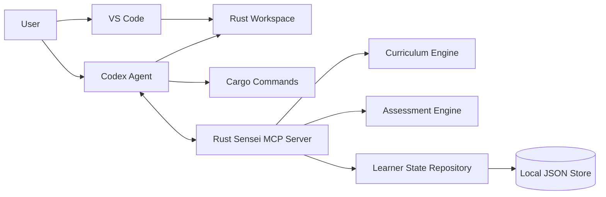

# Rust Sensei

Rust Sensei is a planned local-first MCP server for an adaptive Rust learning agent.

The learner writes Rust code in VS Code. Codex operates in the same workspace, calls Rust Sensei through MCP, verifies work when asked, and presents coaching feedback. Rust Sensei owns learner memory, lesson planning, assessment, progress tracking, and next-step recommendations.

## Goals

- Teach general Rust fluency before specialized tracks.
- Ask exactly 1 initial Rust placement question.
- Adapt lessons based on demonstrated work.
- Track Rust-specific skill separately from general programming skill.
- Use local JSON storage for v1 behind repository interfaces.
- Keep the MCP server agent-neutral so Codex, Claude Code, and other MCP clients can use it.
- Avoid executing arbitrary learner code inside the MCP server in v1.

## Current Status

This repository contains design documentation and a local Python implementation in progress.

- Package metadata and CLI entrypoint.
- Typed DTO and domain models for session, setup, lesson assignment, curriculum, and attempt submission flows.
- JSON repositories for learner profiles, lesson assignments, curriculum seed data, and attempts.
- Atomic JSON writes with file locking and state revision tracking.
- Session service for initial placement and active profile retrieval.
- Lesson service for the first `get_next_lesson` flow, active assignment reuse, and pending-assessment detection after an attempt.
- Assessment service currently implements `submit_attempt` only. `assess_attempt` is not implemented yet.
- Setup service for Python, Cargo, and state directory diagnostics.
- Daily append-only file logging under the configured state directory.
- Initial tests for session, lesson assignment, attempt submission, setup, and JSON state behavior.

Implemented MCP tools in code:

- `start_session`
- `get_learner_profile`
- `get_next_lesson`
- `submit_attempt`
- `get_setup_status`

Known limitations:

- The MCP boundary is not integration-tested because the `mcp` package is not available from the current local package index.
- MCP tools currently use a `payload` wrapper pending SDK schema verification.
- `assess_attempt`, scoring, confidence, skill updates, progress events, `get_progress_summary`, and `update_learner_signal` are not implemented.
- v1 still supports only `local-default` as the learner id.

## Developer Setup

Rust Sensei targets Python `3.11+`.

Install the project with developer dependencies:

```bash
python -m pip install ".[dev]"
```

The MCP SDK package may be unavailable on some package indexes. The current unit tests cover the implemented service, storage, logging, CLI, and DTO layers without starting the MCP server.

## Unit Tests

Run the unit test suite:

```bash
python -m pytest
```

Run tests with coverage:

```bash
python -m pytest --cov=rust_sensei --cov-report=term-missing
```

Coverage must stay above `85%`.

Read the terminal coverage report as follows:

- `Cover`: percentage of statements and branches covered for each file.
- `Missing`: line numbers that were not executed by tests.
- `TOTAL`: project-wide coverage used for the `85%` threshold.
- `Required test coverage of 85.0% reached`: coverage gate passed.

Optional HTML coverage report:

```bash
python -m pytest --cov=rust_sensei --cov-report=html
```

Open `htmlcov/index.html` in a browser to inspect file-by-file coverage. The `htmlcov/` directory is ignored by git.

Latest known verification:

- `54` tests passed.
- Coverage passed at `94.88%`.
- Tests ran under local Python `3.9.6` with compatibility dependencies, while project metadata still targets Python `3.11+`.

## Next Work

Recommended implementation order:

1. Implement `assess_attempt` skeleton with persisted idempotent assessment records.
2. Implement confidence measuring from `docs/lld-confidence-measuring.md`.
3. Implement basic deterministic rubric scoring.
4. Update learner skill model after assessment with confidence dampening.
5. Implement next-step decision rules and adaptive lesson handlers.
6. Expand assignment lifecycle for assessed, abandoned, repeated, and new-variant flows.
7. Add progress events.
8. Add `get_progress_summary`.
9. Add `update_learner_signal`.
10. Add MCP resources for active profile, progress summary, and curriculum concepts.
11. Resolve MCP SDK integration and test tool schemas/calls.
12. Add CLI diagnostics such as `doctor`.
13. Clean up packaging and setup docs.

## Documents

- [HLD](docs/hld.md): High-level system design.
- [MCP Server LLD](docs/lld-mcp-server.md): Low-level design for the Python MCP server.
- [AI Agent LLD](docs/lld-ai-agent.md): Low-level design for how Codex and future agents use Rust Sensei.
- [Adaptive Lessons LLD](docs/lld-adaptive-lessons.md): Low-level design for adaptive lesson selection.
- [Confidence Measuring LLD](docs/lld-confidence-measuring.md): Low-level design for confidence scoring and skill update dampening.

## Planned Architecture



## v1 Defaults

- Language: Python
- Storage: local JSON
- Primary editor: VS Code
- Primary agent: Codex
- Protocol: MCP
- Execution model: learner runs code first, agent verifies later
- Packaging target: `pipx` or `uv tool`
- Docker: not required

## Future Work

- Complete the Python MCP server tool surface.
- Add `assess_attempt` and scoring.
- Add confidence measuring and skill model updates.
- Add progress event repositories and summary derivation.
- Add a `doctor` command for local setup checks.
- Add Codex setup instructions.
- Add Claude Code setup instructions.
- Add optional SQLite storage after the JSON proof of concept.
