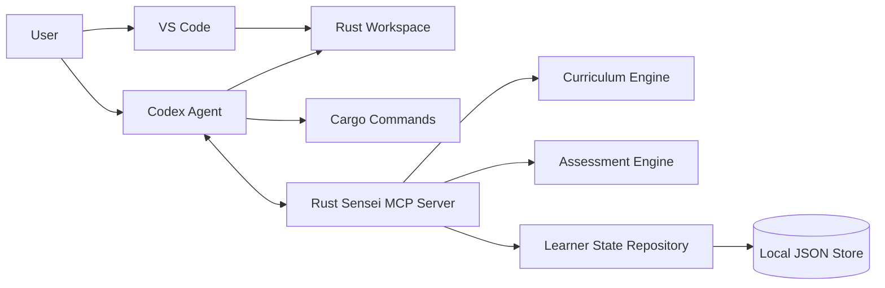

# Rust Sensei

Rust Sensei is a planned local-first MCP server for an adaptive Rust learning agent.

The learner writes Rust code in VS Code. Codex operates in the same workspace, calls Rust Sensei through MCP, verifies work when asked, and presents coaching feedback. Rust Sensei owns learner memory, lesson planning, assessment, progress tracking, and next-step recommendations.

## Goals

- Teach general Rust fluency before specialized tracks.
- Ask exactly 1 initial Rust placement question.
- Adapt lessons based on demonstrated work.
- Track Rust-specific skill separately from general programming skill.
- Use local JSON storage for v1 behind repository interfaces.
- Keep the MCP server agent-neutral so Codex, Claude Code, and other MCP clients can use it.
- Avoid executing arbitrary learner code inside the MCP server in v1.

## Current Status

This repository contains design documentation and a local Python implementation in progress.

- Package metadata and CLI entrypoint.
- Typed DTO and domain models for session, setup, lesson assignment, curriculum, attempt submission, and assessment flows.
- JSON repositories for learner profiles, lesson assignments, curriculum seed data, attempts, assessments, and learner signals.
- Atomic JSON writes with file locking and state revision tracking.
- Session service for initial placement, active profile retrieval, and learner signal recording.
- Lesson service for first assignment selection, active assignment reuse, active-assignment abandonment, pending-assessment detection, and post-assessment adaptive selection.
- Adaptive lesson selection handlers live in `rust_sensei/domain/lesson_selection.py`, including branch target resolution and deterministic prompt variant rotation.
- Assessment service implements `submit_attempt` and an initial `assess_attempt` flow with persisted idempotent assessment records.
- Deterministic rubric scoring and confidence measuring live in `rust_sensei/domain/scoring.py`.
- Skill model updates with confidence dampening live in `rust_sensei/domain/skill_update.py`.
- Append-only progress events are stored for assignment creation/viewing, attempt submission, assessment, and assignment abandonment. Lifecycle events for creation, attempt submission, assessment, and abandonment are written in the same JSON transaction as the canonical state change.
- Progress service implements `get_progress_summary` with completed/repeated/skipped concepts, recent events, recommended focus, and trend.
- Setup service for Python, rustc, Cargo, and state directory diagnostics.
- CLI diagnostics include `setup-status` JSON output and `doctor` human or JSON output.
- Daily append-only file logging under the configured state directory.
- Tests for session, lesson assignment, attempt submission, assessment, scoring, setup, JSON state behavior, and MCP handler registration.

Implemented MCP tools in code:

- `start_session`
- `get_learner_profile`
- `get_next_lesson`
- `submit_attempt`
- `assess_attempt`
- `get_progress_summary`
- `update_learner_signal`
- `get_setup_status`

Implemented MCP resources in code:

- `rust-sensei://profile/active`
- `rust-sensei://progress/summary`
- `rust-sensei://curriculum/concepts`

Implemented MCP prompts in code:

- `rust_sensei_tutor`
- `rust_sensei_attempt_review`
- `rust_sensei_stuck_coaching`

Known limitations:

- MCP handler registration is unit-tested with a fake registrar and covered by focused FastMCP integration tests when the `mcp` extra is installed.
- MCP tools expose direct typed parameters in the registered FastMCP handlers instead of an opaque `payload` wrapper. Project DTO validation still owns validation error envelopes.
- `force_new_variant` is supported only with `abandon_active_assignment` while an active assignment exists.
- `assess_attempt` uses deterministic scoring only. It does not call an LLM.
- v1 still supports only `local-default` as the learner id.

## Current MCP Verification

The former local MCP SDK blocker has been resolved with a project virtual environment.

- Homebrew Python `3.14.5` is available through a sourced shell.
- A local `.venv` was created with `python3 -m venv .venv`.
- `mcp==1.27.1` installs successfully with `.venv/bin/python -m pip install -e ".[dev-mcp]"`.
- Real `FastMCP` registration was verified for tools, resources, prompts, direct-parameter tool schemas, and runtime `call_tool` execution for `start_session` and `get_next_lesson`.

## Developer Setup

Rust Sensei targets Python `3.11+`.

Install the project with developer dependencies:

```bash
python -m pip install -e ".[dev]"
```

Install the MCP server dependency when the package index can provide the official MCP SDK:

```bash
python -m pip install -e ".[mcp]"
```

Use both extras when developing against the real SDK:

```bash
python -m pip install -e ".[dev-mcp]"
```

The MCP SDK package may be unavailable on some package indexes. With `.[dev]`, tests cover the implemented service, storage, logging, CLI, DTO, and fake-registrar MCP handler layers. With `.[dev-mcp]`, the suite also runs focused FastMCP integration tests for registration, schemas, runtime tool calls, and structured validation errors.

Run local setup diagnostics:

```bash
python -m rust_sensei doctor
python -m rust_sensei doctor --json
```

## Unit Tests

Run the unit test suite:

```bash
python -m pytest
```

Run tests with coverage:

```bash
python -m pytest --cov=rust_sensei --cov-report=term-missing
```

Coverage must stay above `85%`.

Read the terminal coverage report as follows:

- `Cover`: percentage of statements and branches covered for each file.
- `Missing`: line numbers that were not executed by tests.
- `TOTAL`: project-wide coverage used for the `85%` threshold.
- `Required test coverage of 85.0% reached`: coverage gate passed.

Optional HTML coverage report:

```bash
python -m pytest --cov=rust_sensei --cov-report=html
```

Open `htmlcov/index.html` in a browser to inspect file-by-file coverage. The `htmlcov/` directory is ignored by git.

Latest known verification:

- `131` tests passed under Python `3.14.5` in `.venv`.
- Real FastMCP registration and runtime calls passed with `mcp==1.27.1`.
- Prior coverage passed at `93.30%`.

## Next Work

Recommended implementation order:

1. Clean up packaging and setup docs around supported Python versions, virtualenv setup, and MCP extras.
2. Add more real-SDK MCP integration tests if a stable in-process testing pattern is adopted.
3. Continue hardening validation, privacy limits, JSON state recovery, and curriculum validation.

## Documents

- [HLD](docs/hld.md): High-level system design.
- [MCP Server LLD](docs/lld-mcp-server.md): Low-level design for the Python MCP server.
- [AI Agent LLD](docs/lld-ai-agent.md): Low-level design for how Codex and future agents use Rust Sensei.
- [Adaptive Lessons LLD](docs/lld-adaptive-lessons.md): Low-level design for adaptive lesson selection.
- [Confidence Measuring LLD](docs/lld-confidence-measuring.md): Low-level design for confidence scoring and skill update dampening.

## Planned Architecture



## v1 Defaults

- Language: Python
- Storage: local JSON
- Primary editor: VS Code
- Primary agent: Codex
- Protocol: MCP
- Execution model: learner runs code first, agent verifies later
- Packaging target: `pipx` or `uv tool`
- Docker: not required

## Future Work

- Complete the Python MCP server tool surface.
- Add an LLM-assisted assessment provider behind the assessment service once the deterministic baseline and idempotency contract are stable.
- Add Codex setup instructions.
- Add Claude Code setup instructions.
- Add optional SQLite storage after the JSON proof of concept.
