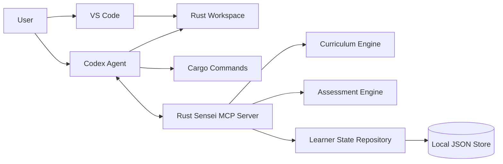

# Rust Sensei

Rust Sensei is a planned local-first MCP server for an adaptive Rust learning agent.

The learner writes Rust code in VS Code. Codex operates in the same workspace, calls Rust Sensei through MCP, verifies work when asked, and presents coaching feedback. Rust Sensei owns learner memory, lesson planning, assessment, progress tracking, and next-step recommendations.

## Goals

- Teach general Rust fluency before specialized tracks.
- Ask exactly 1 initial Rust placement question.
- Adapt lessons based on demonstrated work.
- Track Rust-specific skill separately from general programming skill.
- Use local JSON storage for v1 behind repository interfaces.
- Keep the MCP server agent-neutral so Codex, Claude Code, and other MCP clients can use it.
- Avoid executing arbitrary learner code inside the MCP server in v1.

## Current Status

This repository contains design documentation and the first Python implementation slice:

- Package metadata and CLI entrypoint.
- Typed DTO and domain models for session and setup flows.
- JSON learner profile repository with atomic state writes.
- Session service for placement and active profile retrieval.
- Setup service for Python, Cargo, and state directory diagnostics.
- Daily append-only file logging under the configured state directory.
- Initial tests for session, setup, and JSON state behavior.

## Developer Setup

Rust Sensei targets Python `3.11+`.

Install the project with developer dependencies:

```bash
python -m pip install ".[dev]"
```

The MCP SDK package may be unavailable on some package indexes. The current unit tests cover the implemented service, storage, logging, CLI, and DTO layers without starting the MCP server.

## Unit Tests

Run the unit test suite:

```bash
python -m pytest
```

Run tests with coverage:

```bash
python -m pytest --cov=rust_sensei --cov-report=term-missing
```

Coverage must stay above `85%`.

Read the terminal coverage report as follows:

- `Cover`: percentage of statements and branches covered for each file.
- `Missing`: line numbers that were not executed by tests.
- `TOTAL`: project-wide coverage used for the `85%` threshold.
- `Required test coverage of 85.0% reached`: coverage gate passed.

Optional HTML coverage report:

```bash
python -m pytest --cov=rust_sensei --cov-report=html
```

Open `htmlcov/index.html` in a browser to inspect file-by-file coverage. The `htmlcov/` directory is ignored by git.

## Documents

- [HLD](docs/hld.md): High-level system design.
- [MCP Server LLD](docs/lld-mcp-server.md): Low-level design for the Python MCP server.
- [AI Agent LLD](docs/lld-ai-agent.md): Low-level design for how Codex and future agents use Rust Sensei.
- [Adaptive Lessons LLD](docs/lld-adaptive-lessons.md): Low-level design for adaptive lesson selection.
- [Confidence Measuring LLD](docs/lld-confidence-measuring.md): Low-level design for confidence scoring and skill update dampening.

## Planned Architecture



## v1 Defaults

- Language: Python
- Storage: local JSON
- Primary editor: VS Code
- Primary agent: Codex
- Protocol: MCP
- Execution model: learner runs code first, agent verifies later
- Packaging target: `pipx` or `uv tool`
- Docker: not required

## Future Work

- Complete the Python MCP server tool surface.
- Add a `doctor` command for local setup checks.
- Add lesson assignment, attempt, assessment, and progress repositories.
- Add adaptive curriculum seed data.
- Add Codex setup instructions.
- Add Claude Code setup instructions.
- Add optional SQLite storage after the JSON proof of concept.
