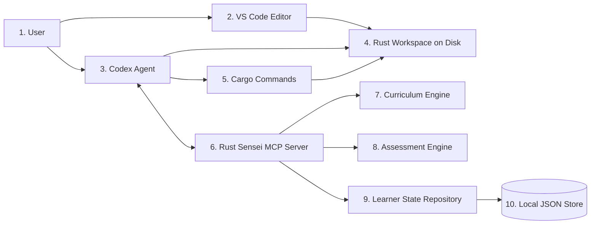

# Rust Sensei HLD

## 1. Overview / Summary

Rust Sensei is a local-first MCP server for an adaptive Rust learning agent.

The learner writes Rust code in VS Code. Codex operates against the same local workspace, uses Rust Sensei through MCP, runs verification commands when asked, and presents coaching feedback to the learner. Rust Sensei owns lesson planning, learner memory, assessment, progress tracking, and next-step recommendations.

The v1 system supports 1 learner profile stored in local JSON. The storage layer must use repository interfaces so JSON can later be replaced by SQLite or another database without changing lesson, assessment, or MCP tool logic.

Rust Sensei must not depend on Codex-specific APIs. Codex is the primary documented client for v1, but the MCP interface must remain usable by other agents such as Claude Code.

This design supports these primary requirements:

- `FR-01`: Ask exactly 1 initial Rust experience placement question.
- `FR-02`: Use demonstrated work to update skill estimates after placement.
- `FR-03`: Track Rust-specific skill separately from general programming skill.
- `FR-05`: Support adaptive lesson progression.
- `FR-09`: Store local learner state in JSON for v1.
- `FR-10`: Abstract persistence for future database support.
- `FR-12`: Keep the MCP server agent-neutral.
- `NFR-01`: Implement in Python.
- `NFR-02`: Operate local-first for v1.
- `NFR-06`: Do not execute arbitrary learner code inside the MCP server in v1.

## 2. Functional Requirements

### 2.1 Learner Placement And Profile

- `FR-01`: On first use, Rust Sensei must ask exactly 1 initial Rust experience question with these allowed answers: `new`, `beginner`, `intermediate`, `proficient`, `expert`.
- `FR-02`: Rust Sensei must treat initial placement as provisional and update skill estimates after each assessed attempt.
- `FR-03`: Rust Sensei must track Rust-specific skill separately from general programming skill.
- `FR-11`: v1 must support 1 active learner profile, but the data model must include a learner identifier so multi-learner support can be added later.

### 2.2 Lesson Planning

- `FR-05`: Rust Sensei must choose one of these next-step actions after each assessment: `simplify`, `repeat`, `continue`, `accelerate`, `branch`.
- `FR-06`: The default curriculum target must be general Rust fluency before specialized tracks.
- `FR-06`: Specialized tracks such as CLI tools, backend services, async, performance, or LeetCode-style practice are out of the v1 default path unless assessment results justify a branch.
- `FR-01`: A learner who selects `new` may start with Hello World and Cargo basics.
- `FR-01`: A learner who selects `proficient` or `expert` must not be required to complete Hello World, defining a string, or equivalent beginner tasks unless later work shows a need for remediation.

### 2.3 Adaptive Curriculum

- `FR-05`: The curriculum must be represented as a structured concept graph, not as a fixed list of static lesson scripts.
- `FR-05`: Each concept must define prerequisites, competency goals, baseline task criteria, stretch signals, struggle signals, and next-step policy inputs.
- `FR-05`: Lesson content must vary based on learner profile, assessment history, confidence, and current concept.
- `FR-05`: If a learner demonstrates competence beyond the prompt, Rust Sensei must support skipping, compressing, or increasing difficulty for future lessons.
- `FR-05`: If a learner struggles, Rust Sensei must support smaller prompts, repeated practice, and targeted remediation.

### 2.4 Assessment

- `FR-04`: Rust Sensei must assess submitted work across rubric dimensions including correctness, readability, maintainability, problem solving, DSA, Rust idioms, and compiler-error handling.
- `FR-04`: Each rubric dimension must produce a score, confidence value, and evidence summary.
- `FR-08`: Rust Sensei must accept assessment input containing assignment id, submitted code, relevant file paths, compiler output, runtime output, test output, learner notes, and agent notes when available.
- `FR-02`: Assessment must update both Rust-specific skill and general programming skill.
- `FR-04`: Assessment must support hybrid signals from code, command output, learner notes, and conversation summaries.
- `FR-04`: Rust Sensei owns canonical scoring and progression decisions. Agent notes are evidence or diagnostic context, not authoritative assessment results.
- `FR-04`: Rust Sensei may return insufficient evidence instead of assigning full rubric scores when critical artifacts are missing.

### 2.5 Execution Flow

- `FR-07`: Lessons must encourage learner-owned execution before agent-run verification.
- `FR-07`: Early lessons must require the learner to practice commands such as `cargo new`, `cargo run`, `cargo check`, and later `cargo test`.
- `FR-07`: When the learner asks for assessment, Codex may run verification commands and submit the output to Rust Sensei.
- `NFR-06`: Rust Sensei must not run arbitrary learner code in v1.

### 2.6 MCP Interface

- `FR-12`: Rust Sensei must expose MCP tools, resources, and prompts that are client-neutral.
- `FR-12`: Codex-specific setup belongs in documentation and config examples, not in core server logic.
- `FR-12`: Claude Code and other MCP clients should be able to call the same tools without server changes.

Planned MCP tools:

- `start_session`: Create or resume the active learner session.
- `get_next_lesson`: Return the active lesson assignment or create a new assignment when progression requires it.
- `submit_attempt`: Persist code, command output, notes, and context for a lesson assignment.
- `assess_attempt`: Assess an attempt exactly once and return scores, evidence, feedback, and next-step action.
- `get_learner_profile`: Return current learner profile and skill estimates.
- `get_progress_summary`: Return completed concepts, current concept, trend, and recommended focus.
- `update_learner_signal`: Record non-code signals such as confusion, confidence, or self-reported blockers.
- `get_setup_status`: Return setup checks and missing prerequisites.

### 2.7 Local State And Setup

- `FR-09`: v1 must store learner state in local JSON.
- `FR-10`: Persistence must be accessed through repository interfaces.
- `FR-10`: JSON read-modify-write operations must use a single-writer lock and a state revision value to prevent lost updates.
- `FR-10`: Progress summaries must be derived from canonical records where possible.
- `FR-10`: Rust Sensei must persist lesson assignments, attempts, assessments, learner signals, and progress events for auditability.
- `FR-13`: The project must include a setup and diagnostics path.
- `FR-13`: A future `doctor` command must check Python, Rust, Cargo, writable state path, lesson catalog availability, and MCP server startup.

### 2.8 Session And Placement Protocol

- `FR-01`: `start_session` with no existing profile and no placement value must return `placement_required: true` and the allowed choices.
- `FR-01`: The agent must ask exactly 1 placement question using the allowed choices.
- `FR-01`: The agent must call `start_session` again with the selected placement value.
- `FR-01`: Rust Sensei must create the profile only after receiving a valid placement value.
- `FR-01`: After placement is persisted, Rust Sensei must not ask the placement question again for that learner.
- `FR-01`: Invalid placement values must return validation errors without creating a profile.

### 2.9 Assignment And Assessment Protocol

- `FR-05`: `get_next_lesson` must persist a `LessonAssignment` when it creates a new instructional assignment.
- `FR-05`: `get_next_lesson` must return the active unattempted assignment by default instead of creating duplicate assignments.
- `FR-05`: A new assignment may be created after assessment changes progression, after explicit abandonment, or when the client requests a new variant through a defined parameter.
- `FR-08`: `submit_attempt` must persist an attempt and return a server-generated `attempt_id`.
- `FR-08`: `submit_attempt` must link each attempt to the exact `assignment_id` the learner received.
- `FR-04`: `assess_attempt` must be idempotent. Retrying it for an already assessed attempt returns the existing assessment and must not update skill scores twice.

## 3. Non-Functional Requirements

- `NFR-01`: The MCP server must be implemented in Python.
- `NFR-02`: v1 must run locally on the learner machine.
- `NFR-03`: v1 must not require Docker.
- `NFR-04`: MCP tools, resources, and prompts must be client-agnostic.
- `NFR-05`: Feedback must be coaching-oriented by default and become more direct as learner skill and confidence increase.
- `NFR-06`: The MCP server must not execute arbitrary learner code in v1.
- `NFR-07`: The package should support installation through `pipx` or `uv tool`.
- `NFR-08`: Storage adapter boundaries must be explicit.
- `NFR-09`: Local state writes must be atomic to reduce the chance of corrupt JSON.
- `NFR-10`: The server must be usable without network access after dependencies are installed.
- `NFR-11`: Local state updates must be protected from lost updates through file locking or an equivalent single-writer mechanism.

## 4. HLD Summary

Rust Sensei has 5 main subsystems:

1. MCP server interface
2. Learner state service
3. Curriculum engine
4. Assessment engine
5. Storage adapter

The MCP server receives tool calls from Codex or another MCP client. The learner state service reads the active profile and progress history. The curriculum engine selects the next concept, lesson prompt, success criteria, and rubric. The assessment engine scores submitted attempts and computes the next-step action. The storage adapter persists state in JSON for v1.

Codex is responsible for interacting with the workspace. Codex reads files, asks the learner for notes when useful, runs `cargo check`, `cargo run`, or `cargo test` when the learner requests assessment, and sends the collected context to Rust Sensei.

Rust Sensei is responsible for deciding what the learner should do next and why.

Core data concepts:

- Learner profile: learner id, initial Rust level, current skill estimates, preferences, and active path.
- Skill model: Rust concept scores, general programming scores, confidence, and evidence.
- Concept graph: ordered Rust concepts with prerequisites and adaptive policies.
- Lesson assignment: assignment id, lesson id, concept id, difficulty, variant id, selection rationale, curriculum version, status, and timestamps.
- Lesson attempt: assignment id, code, outputs, notes, timestamps, and workspace references.
- Assessment result: attempt id, scores, evidence, feedback, confidence, scoring version, and next-step action.
- Progress event: append-only record of assignment, attempt, assessment, completion, repeat, simplification, acceleration, branch, reopen, abandonment, or view events.
- Repository interfaces: learner, curriculum, assessment, and session persistence boundaries.
- JSON storage adapter: v1 implementation of repository interfaces.

The v1 storage design supports 1 active learner, but the schema must include `learner_id` fields on learner, session, attempt, and assessment records. This supports later migration to multiple learners.

The v1 curriculum starts with general Rust fluency:

1. Environment, Cargo, and Hello World
2. Variables, primitive types, and printing
3. Mutability, shadowing, and compiler feedback
4. Functions and expression-based returns
5. Conditionals and control flow
6. Loops, arrays, vectors, and iteration
7. Ownership, borrowing, and references
8. Structs, enums, and pattern matching
9. Option, Result, and error handling
10. Modules, testing, and small projects

Placement rules:

- `new`: Start with environment, Cargo, and Hello World.
- `beginner`: Start with variables, mutability, functions, and compiler feedback.
- `intermediate`: Start with ownership, borrowing, structs, enums, or error handling.
- `proficient`: Start with idioms, traits, generics, testing, or applied project tasks.
- `expert`: Start with advanced review, performance, async, unsafe concepts, or architecture-level Rust tasks.

All placement rules are provisional. Assessment can slow down, repeat, skip, or accelerate the path.

## 5. HLD Diagram

Diagram description:

1. User: Writes Rust code, runs commands, asks for help, and requests assessment.
2. VS Code Editor: Primary coding environment for the learner.
3. Codex Agent: Conversational agent that reads workspace files, runs verification commands, and calls Rust Sensei through MCP.
4. Rust Workspace on Disk: Shared source of truth for learner code, edited by the user and inspected by Codex.
5. Cargo Commands: `cargo check`, `cargo run`, and `cargo test` commands used for learner practice and agent verification.
6. Rust Sensei MCP Server: Local Python MCP server that exposes tutoring, assessment, progress, and setup tools.
7. Curriculum Engine: Selects concepts, lesson prompts, success criteria, hints, and next-step actions.
8. Assessment Engine: Scores attempts across Rust skill and general programming skill dimensions.
9. Learner State Repository: Persistence boundary for profile, session, progress, attempt, and assessment records.
10. Local JSON Store: v1 storage adapter for 1 local learner profile.

Requirement mapping:

- `FR-07`: The learner uses VS Code and Cargo before Codex verification.
- `FR-08`: Codex sends code and command output to Rust Sensei.
- `FR-09`: Learner state is stored in local JSON.
- `FR-12`: Codex uses MCP, but Rust Sensei remains client-neutral.
- `NFR-06`: Cargo execution is outside Rust Sensei.

## 6. User Perspective Flow

1. The learner opens a Rust workspace in VS Code.
2. The learner starts Codex in the same workspace.
3. Codex connects to the local Rust Sensei MCP server.
4. On first use, Rust Sensei asks 1 placement question: `new`, `beginner`, `intermediate`, `proficient`, or `expert`. This satisfies `FR-01`.
5. Codex calls `start_session`.
6. Codex calls `get_next_lesson`.
7. Rust Sensei returns the target concept, prompt, success criteria, hints, and rubric. This satisfies `FR-05`.
8. Codex explains the assignment to the learner.
9. The learner writes Rust code in VS Code.
10. The learner runs the requested command in the VS Code terminal. Early commands include `cargo run` and `cargo check`. This satisfies `FR-07`.
11. The learner fixes errors or asks Codex for help.
12. When ready, the learner asks Codex to assess the work.
13. Codex reads the relevant files and runs verification commands such as `cargo check`, `cargo run`, or `cargo test`.
14. Codex calls `submit_attempt` with assignment id, code, command output, learner notes, and context. This satisfies `FR-08`.
15. Rust Sensei persists the attempt and returns a server-generated `attempt_id`.
16. Codex calls `assess_attempt` with the `attempt_id`.
17. Rust Sensei returns an existing assessment for duplicate assessment requests or creates one assessment for a new attempt.
18. Rust Sensei scores the attempt across rubric dimensions and updates learner state. This satisfies `FR-02`, `FR-03`, and `FR-04`.
19. Rust Sensei returns feedback, evidence, confidence, and one next-step action: `simplify`, `repeat`, `continue`, `accelerate`, or `branch`. This satisfies `FR-05`.
20. Codex presents coaching feedback and the next learning step.
21. The learner continues the cycle.

Example adaptive outcomes:

- If the learner creates 1 correct integer variable but struggles with strings, Rust Sensei returns `repeat` with a focused string task.
- If the learner creates multiple typed variables with meaningful names and explains inference, Rust Sensei returns `accelerate`.
- If the learner writes correct Rust but poor structure, Rust Sensei keeps the Rust concept moving and adds general code quality feedback.
- If the learner reports confusion despite compiling code, Rust Sensei lowers confidence and returns `simplify` or targeted hints.

## 7. Failure Scenarios

### 7.1 Rust Toolchain Missing

- Trigger: Codex or `doctor` cannot find `rustc`.
- Related requirements: `FR-07`, `FR-13`.
- Expected behavior: Rust Sensei reports setup incomplete and recommends installing Rust through `rustup`.
- Assessment behavior: Do not score Rust skill from failed setup alone.

### 7.2 Cargo Missing

- Trigger: Codex or `doctor` cannot find `cargo`.
- Related requirements: `FR-07`, `FR-13`.
- Expected behavior: Rust Sensei reports setup incomplete and blocks lessons that require Cargo commands.
- Assessment behavior: Record workflow blocker, not coding failure.

### 7.3 MCP Server Unavailable

- Trigger: Codex cannot connect to Rust Sensei.
- Related requirements: `FR-12`, `FR-13`.
- Expected behavior: Codex reports that the MCP server is unavailable and suggests running the configured server command.
- Assessment behavior: No learner state update occurs.

### 7.4 Invalid JSON State

- Trigger: JSON parse failure, missing required fields, or incompatible version.
- Related requirements: `FR-09`, `FR-10`, `NFR-09`.
- Expected behavior: Rust Sensei refuses to overwrite the invalid file, reports the state path, and offers recovery options.
- Assessment behavior: Do not create new progress over invalid state without explicit recovery.

### 7.5 Learner Code Does Not Compile

- Trigger: `cargo check` returns a non-zero exit code.
- Related requirements: `FR-04`, `FR-07`, `FR-08`.
- Expected behavior: Rust Sensei assesses compiler-error handling, relevant concept understanding, and next remediation step.
- Assessment behavior: Compilation failure is evidence, not an automatic failure for every rubric dimension.

### 7.6 Codex Cannot Access Workspace

- Trigger: Codex cannot read files or run commands in the Rust workspace.
- Related requirements: `FR-08`, `FR-12`.
- Expected behavior: Codex asks the learner to open the correct workspace or provide pasted code and output.
- Assessment behavior: Rust Sensei may assess pasted code if provided.

### 7.7 Low Assessment Confidence

- Trigger: Submitted context lacks code, command output, learner notes, or enough evidence.
- Related requirements: `FR-02`, `FR-04`, `FR-05`.
- Expected behavior: Rust Sensei returns a low confidence result and requests one additional concrete signal.
- Assessment behavior: Skill estimates must change less than they would for a high-confidence assessment.

### 7.8 Wrong Difficulty Selected

- Trigger: Learner feedback or next attempt shows the selected lesson was too easy or too hard.
- Related requirements: `FR-02`, `FR-05`, `NFR-05`.
- Expected behavior: Rust Sensei updates confidence and selects `simplify`, `repeat`, or `accelerate` on the next step.
- Assessment behavior: Wrong difficulty is treated as calibration data, not as learner failure.

### 7.9 Agent Submits Incomplete Attempt

- Trigger: Missing lesson id, code, command output, or context fields.
- Related requirements: `FR-08`, `NFR-04`.
- Expected behavior: Rust Sensei returns a structured validation error with missing fields.
- Assessment behavior: No learner skill update occurs.

### 7.10 Storage Path Not Writable

- Trigger: JSON state directory cannot be created or written.
- Related requirements: `FR-09`, `FR-13`, `NFR-09`.
- Expected behavior: Rust Sensei reports the path and required permission.
- Assessment behavior: No assessment should be accepted if progress cannot be persisted.

### 7.11 Concurrent State Update

- Trigger: 2 mutating MCP calls attempt to update JSON state at the same time.
- Related requirements: `FR-10`, `NFR-11`.
- Expected behavior: Rust Sensei serializes writes through a lock or returns a retryable conflict error.
- Assessment behavior: No skill score should be updated from stale state.

### 7.12 Duplicate Lesson Request

- Trigger: The agent calls `get_next_lesson` multiple times before the learner submits an attempt.
- Related requirements: `FR-05`, `FR-10`.
- Expected behavior: Rust Sensei returns the active unattempted assignment and records a view event instead of creating duplicate assignments.
- Assessment behavior: Prompt-repeat logic should count created assignments, not view events.

## Appendix A. Future Changes

### A.1 Future Changes Discussed

- Multi-learner support: v1 supports 1 active learner, but records include `learner_id` so later versions can support multiple local profiles or hosted users.
- Database storage: v1 uses JSON, but repository interfaces should allow a later SQLite or hosted database adapter without changing MCP tools or assessment logic.
- Other MCP clients: Codex is the primary documented client for v1, but Claude Code and other MCP clients should be supported through the same tools.
- Packaged installation: Later versions should support `pipx install rust-sensei` or `uv tool install rust-sensei`.
- `doctor` command: Later versions should include a CLI diagnostic command that checks Python, Rust, Cargo, state path, lesson catalog, and MCP startup.
- Specialized tracks: After general Rust fluency, later versions can add CLI, backend, async, performance, systems programming, and LeetCode-style tracks.
- Optional code runner: v1 does not execute learner code inside Rust Sensei. A later version may add a sandboxed runner behind a separate interface.
- Richer editor integration: VS Code is the target editor for v1. Later versions may add editor-specific helpers for debugger practice, rust-analyzer diagnostics, or current-file submission.
- Hosted mode: Later versions may support remote accounts, synced progress, and team or classroom usage. This is outside v1.
