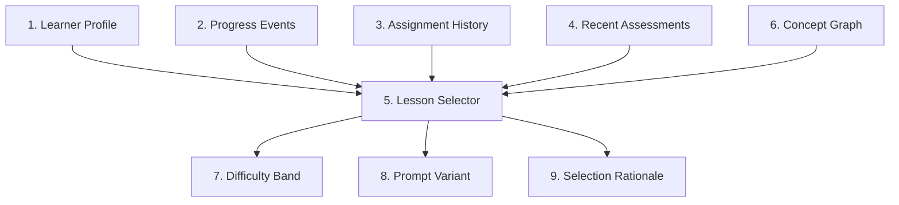

# Rust Sensei Adaptive Lessons LLD

## 1. Overview / Summary

This document defines how Rust Sensei adapts lessons based on learner performance.

The curriculum is a concept graph. Each concept has prerequisites, competencies, baseline tasks, stretch signals, struggle signals, and next-step policies. Lesson text is generated or assembled from structured lesson specs and learner state.

Primary requirement links:

- `FR-01`: Initial Rust level selects the starting point.
- `FR-02`: Demonstrated work updates skill estimates.
- `FR-03`: Rust and general programming skill are separate.
- `FR-05`: Lessons adapt using simplify, repeat, continue, accelerate, or branch.
- `FR-06`: General Rust fluency is the default path.
- `NFR-05`: Coaching tone adapts with learner skill.

## 2. Functional Requirements

- `AL-FR-01`: The curriculum must be stored as structured concept specs.
- `AL-FR-02`: Each concept must define prerequisite concept ids.
- `AL-FR-03`: Each concept must define baseline competency criteria.
- `AL-FR-04`: Each concept must define stretch signals.
- `AL-FR-05`: Each concept must define struggle signals.
- `AL-FR-06`: Lesson selection must use learner profile, recent assessments, and confidence.
- `AL-FR-07`: Lesson selection must support `simplify`, `repeat`, `continue`, `accelerate`, and `branch`.
- `AL-FR-08`: A learner who starts as `proficient` or `expert` must skip beginner concepts unless later evidence requires remediation.
- `AL-FR-09`: Demonstrated mastery may mark a concept complete without assigning all practice variants.
- `AL-FR-10`: The system must record why a lesson was selected.
- `AL-FR-11`: The system must persist assignment history and use it during adaptation.
- `AL-FR-12`: Placement skips must be represented as provisional skips, not completed concepts.

## 3. Non-Functional Requirements

- `AL-NFR-01`: Lesson specs must be editable without changing Python service code.
- `AL-NFR-02`: Lesson ids and concept ids must be stable.
- `AL-NFR-03`: Lesson selection must be deterministic for the same learner state and curriculum version.
- `AL-NFR-04`: Adaptive behavior must be explainable through evidence.
- `AL-NFR-05`: Lesson selection should avoid repeating the same prompt text more than 2 times in a row.

## 4. LLD Summary

Adaptive lessons use 4 inputs:

1. Initial Rust placement
2. Concept graph
3. Recent assessments
4. Confidence scores

The lesson service selects a concept, selects a difficulty band, builds a lesson prompt, and returns a next-step rationale.

### 4.1 Concept Spec Model

```python
from dataclasses import dataclass
from typing import Literal

Difficulty = Literal["intro", "guided", "standard", "challenge", "advanced"]


@dataclass
class ConceptSpec:
    concept_id: str
    title: str
    order: int
    prerequisites: list[str]
    default_difficulty: Difficulty
    competency_goals: list[str]
    baseline_task: str
    learner_command: str | None
    stretch_signals: list[str]
    struggle_signals: list[str]
    rubric_ids: list[str]
    next_concepts: list[str]
    branch_targets: dict[str, list[str]]
    completion_thresholds: dict[str, float]


@dataclass
class LessonSelectionDecision:
    lesson_id: str
    concept_id: str
    difficulty: Difficulty
    variant_id: str
    branch_id: str | None
    next_action_reason: str
    skipped_concepts: list[str]
    prompt_inputs: dict[str, str]
```

`LessonSelectionDecision` is an internal pre-assignment object. The MCP server maps it to the persisted `LessonAssignment`, which owns assignment status, timestamps, curriculum version, and learner id.

### 4.2 Example Concept Spec

```json
{
  "concept_id": "variables_primitive_types",
  "title": "Variables And Primitive Types",
  "order": 20,
  "prerequisites": ["cargo_hello_world"],
  "default_difficulty": "guided",
  "competency_goals": [
    "Declare immutable variables",
    "Use string, integer, float, boolean, and char values",
    "Print values with println!",
    "Recognize type inference"
  ],
  "baseline_task": "Create and print 3 variables with different primitive types.",
  "learner_command": "cargo run",
  "stretch_signals": [
    "Uses meaningful variable names",
    "Adds more than 3 appropriate types",
    "Explains inferred types correctly",
    "Keeps output readable"
  ],
  "struggle_signals": [
    "Cannot compile a basic variable declaration",
    "Confuses string literals and String",
    "Uses unclear names",
    "Does not run cargo command"
  ],
  "rubric_ids": [
    "rust_correctness",
    "rust_idioms",
    "readability",
    "compiler_error_handling"
  ],
  "next_concepts": ["mutability_shadowing"],
  "branch_targets": {
    "compiler_feedback_remediation": ["compiler_errors_basic"],
    "problem_solving_enrichment": ["variables_small_problem"]
  },
  "completion_thresholds": {
    "rust_correctness": 0.70,
    "rust_idioms": 0.60,
    "readability": 0.60
  }
}
```

### 4.3 Difficulty Bands

| Band | Use when | Example variables task |
| --- | --- | --- |
| `intro` | Learner is new or struggling | Declare 1 integer and print it |
| `guided` | Learner needs structured practice | Declare 3 variables of different types |
| `standard` | Learner shows expected progress | Build a small profile output from typed variables |
| `challenge` | Learner exceeds baseline | Add formatting, mutation, and a small calculation |
| `advanced` | Learner shows strong transfer | Model typed data and explain tradeoffs |

### 4.4 Selection Handler Registry

Lesson selection must use a handler registry instead of a central conditional chain. This keeps next-action behavior extensible without requiring class-per-action complexity in v1. Adding a new action should require adding 1 handler function and registering it, not editing every selection call site.

```python
from collections.abc import Callable


LessonHandler = Callable[["LessonSelectionContext"], LessonPlan]


def select_simplified_lesson(context: "LessonSelectionContext") -> LessonPlan:
    return context.lesson_factory.build_lesson(
        concept_id=context.last_assignment.concept_id,
        difficulty=context.difficulty_scale.lower(context.last_assignment.difficulty),
    )


class LessonSelector:
    def __init__(self, handlers: dict[str, LessonHandler], placement_policy):
        self.handlers = handlers
        self.placement_policy = placement_policy

    def select_next_lesson(self, context: "LessonSelectionContext") -> LessonPlan:
        if context.is_new_session:
            return self.placement_policy.select(context)

        action = context.last_assessment.next_action
        return self.handlers[action](context)
```

Required v1 handlers:

| Action | Handler | Selection behavior |
| --- | --- | --- |
| `simplify` | `select_simplified_lesson` | Same concept, lower difficulty |
| `repeat` | `select_repeat_variant` | Same concept, same difficulty, new variant |
| `continue` | `select_next_concept` | Next concept, standard difficulty |
| `accelerate` | `select_accelerated_concept` | Next unmastered concept, challenge difficulty |
| `branch` | `select_branch_lesson` | Branch target selected from assessment evidence |

The `LessonSelector` should be the only service that resolves `next_action` to behavior.

### 4.5 Starting Placement

| Initial level | Starting concept | Initial difficulty |
| --- | --- | --- |
| `new` | `cargo_hello_world` | `intro` |
| `beginner` | `variables_primitive_types` | `guided` |
| `intermediate` | `ownership_borrowing_intro` | `standard` |
| `proficient` | `traits_generics_testing` | `challenge` |
| `expert` | `advanced_design_review` | `advanced` |

Placement skip behavior:

- Concepts before the starting concept are marked `provisionally_skipped`.
- Provisionally skipped concepts are not treated as completed.
- Later assessment evidence may confirm the skip or reopen the concept.
- Reopening a skipped concept creates a `reopened` progress event.

### 4.6 Next-Step Rule Set

Next-step action selection must use ordered rules instead of a hardcoded conditional chain. The first matching rule wins. New action types or thresholds should be added by changing rule data or adding a rule object.

Specific branch and remediation rules must run before broad low-score rules.

```python
from dataclasses import dataclass
from typing import Callable


@dataclass(frozen=True)
class NextStepRule:
    rule_id: str
    action: str
    branch_id: str | None
    predicate: Callable[["AssessmentSummary"], bool]
    reason: str


NEXT_STEP_RULES = [
    NextStepRule(
        rule_id="low_confidence_repeat",
        action="repeat",
        branch_id=None,
        predicate=lambda a: a.confidence < 0.45,
        reason="Assessment confidence is below 0.45.",
    ),
    NextStepRule(
        rule_id="compiler_feedback_branch",
        action="branch",
        branch_id="compiler_feedback_remediation",
        predicate=lambda a: (
            a.compiler_error_handling_score < 0.50
            and a.recent_compile_failures >= 2
        ),
        reason="Repeated compiler-error struggles require targeted remediation.",
    ),
    NextStepRule(
        rule_id="problem_solving_branch",
        action="branch",
        branch_id="problem_solving_enrichment",
        predicate=lambda a: (
            a.rust_score >= 0.70
            and a.problem_solving_score < 0.55
            and a.confidence >= 0.60
        ),
        reason="Rust syntax is progressing faster than problem-solving skill.",
    ),
    NextStepRule(
        rule_id="rust_gap_simplify",
        action="simplify",
        branch_id=None,
        predicate=lambda a: a.rust_score < 0.50,
        reason="Rust concept score is below 0.50.",
    ),
    NextStepRule(
        rule_id="strong_performance_accelerate",
        action="accelerate",
        branch_id=None,
        predicate=lambda a: (
            a.rust_score >= 0.85
            and a.general_programming_score >= 0.80
            and a.confidence >= 0.70
        ),
        reason="Rust, general programming, and confidence scores meet acceleration thresholds.",
    ),
    NextStepRule(
        rule_id="expected_progress_continue",
        action="continue",
        branch_id=None,
        predicate=lambda a: a.rust_score >= 0.70 and a.confidence >= 0.60,
        reason="Rust score and confidence meet continuation thresholds.",
    ),
]


def choose_next_action(assessment: "AssessmentSummary") -> tuple[str, str | None, str]:
    for rule in NEXT_STEP_RULES:
        if rule.predicate(assessment):
            return rule.action, rule.branch_id, rule.reason

    return "repeat", None, "No higher-priority rule matched."
```

Thresholds are v1 defaults. They should be tuned after at least 20 assessed attempts from real usage.

Branch target semantics:

- `branch_targets` keys are stable `branch_id` values.
- A next-step rule returning `branch` must also return a `branch_id`.
- `select_branch_lesson` resolves the branch by looking up `concept.branch_targets[branch_id]`.
- Branches may be remediation, enrichment, or temporary alternate paths. The branch id defines the branch purpose.

### 4.7 Mastery And Completion Rules

Concept completion is based on rubric scores and confidence.

Default v1 completion rules:

- A standard concept is complete when all required rubric dimensions meet the concept threshold and each required dimension has confidence at least `0.60`.
- A challenge-level attempt can complete the concept when Rust correctness is at least `0.85`, general programming score is at least `0.80`, and overall confidence is at least `0.70`.
- A completed concept can be reopened if later evidence shows a required rubric dimension below `0.50` with confidence at least `0.60`.
- Reopened concepts return through the normal selection handler registry.

Completion emits a `completed` progress event. Reopening emits a `reopened` progress event.

### 4.8 Assignment History And Prompt Variants

Lesson selection uses persisted assignment history.

- `get_next_lesson` creates a `LessonAssignment` when a new instructional decision is made.
- Reopening the current active assignment records `assignment_viewed`, not `assignment_created`.
- Repeat detection and prompt-variation logic use `assignment_created` events only.
- Each assignment includes `assignment_id`, `lesson_id`, `concept_id`, `difficulty`, `variant_id`, `selection_rationale`, and `curriculum_version`.
- Variant selection must be deterministic from stable inputs such as learner id, concept id, difficulty, curriculum version, and repeat count.
- The same `variant_id` should not be assigned more than 2 times in a row for the same concept and difficulty.

Variant exhaustion behavior:

- Prefer a variant not used in the last 2 created assignments for the same concept and difficulty.
- If all variants were used recently and confidence is below `0.45`, ask for missing evidence or repeat with the least recent variant.
- If all variants were used recently and the learner is struggling, lower difficulty before reusing a variant.
- If reuse is unavoidable, allow reuse only with an explicit selection rationale.

### 4.9 Curriculum Validation

Curriculum validation runs at server startup.

Required checks:

- All concept ids are unique.
- All prerequisite ids exist.
- All next concept ids exist.
- All branch target ids exist.
- All rubric ids exist.
- The default path has no unintended cycles.
- Every non-terminal concept has at least 1 reachable next concept or branch target.
- Lesson ids and variant ids are stable within a curriculum version.

## 5. LLD Diagram



Diagram description:

1. Learner Profile: Initial placement and current skill model.
2. Progress Events: Append-only history of instructional state changes.
3. Assignment History: Created and viewed lesson assignments.
4. Recent Assessments: Latest rubric scores and next actions.
5. Lesson Selector: Service that chooses the next concept and difficulty.
6. Concept Graph: Structured curriculum data.
7. Difficulty Band: Intro, guided, standard, challenge, or advanced.
8. Prompt Variant: Deterministic lesson variant selected for this assignment.
9. Selection Rationale: Explanation of why the lesson was selected.

## 6. User Perspective Flow

1. The learner answers the initial Rust level question.
2. Rust Sensei selects a starting concept and difficulty.
3. The learner completes the assignment.
4. Rust Sensei assesses the attempt.
5. Rust Sensei updates concept scores and confidence.
6. Rust Sensei picks one next-step action.
7. The next prompt is easier, similar, normal, harder, or branched based on evidence.

## 7. Failure Scenarios

### 7.1 No Eligible Concept

- Trigger: All concepts are complete or prerequisites are inconsistent.
- Expected behavior: Return a project-style review task and report curriculum inconsistency.
- Requirement link: `AL-FR-02`.

### 7.2 Repeated Prompt Loop

- Trigger: Same lesson text would be returned more than 2 times in a row.
- Expected behavior: Return a new variant or ask for missing evidence.
- Requirement link: `AL-NFR-05`.

### 7.3 Initial Placement Is Wrong

- Trigger: Learner-selected level conflicts with demonstrated work.
- Expected behavior: Update confidence and adjust difficulty.
- Requirement link: `FR-02`.

### 7.4 Assessment Confidence Too Low

- Trigger: Missing code, output, notes, or evidence.
- Expected behavior: Repeat or request more evidence before changing placement.
- Requirement link: `FR-04`.

### 7.5 Concept Spec Invalid

- Trigger: Missing prerequisites, rubric ids, or next concept references.
- Expected behavior: Fail startup validation and report invalid concept ids.
- Requirement link: `AL-FR-01`.

## Appendix A. Future Changes

### A.1 Future Changes Discussed

- Add specialized tracks after general Rust fluency.
- Add generated exercise variants from the concept graph.
- Add spaced repetition for weak concepts.
- Add project-based capstones after core concepts.
- Add learner-selected goals once baseline fluency is established.
