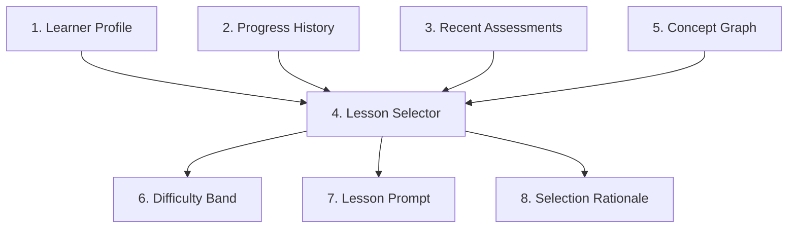

# Rust Sensei Adaptive Lessons LLD

## 1. Overview / Summary

This document defines how Rust Sensei adapts lessons based on learner performance.

The curriculum is a concept graph. Each concept has prerequisites, competencies, baseline tasks, stretch signals, struggle signals, and next-step policies. Lesson text is generated or assembled from structured lesson specs and learner state.

Primary requirement links:

- `FR-01`: Initial Rust level selects the starting point.
- `FR-02`: Demonstrated work updates skill estimates.
- `FR-03`: Rust and general programming skill are separate.
- `FR-05`: Lessons adapt using simplify, repeat, continue, accelerate, or branch.
- `FR-06`: General Rust fluency is the default path.
- `NFR-05`: Coaching tone adapts with learner skill.

## 2. Functional Requirements

- `AL-FR-01`: The curriculum must be stored as structured concept specs.
- `AL-FR-02`: Each concept must define prerequisite concept ids.
- `AL-FR-03`: Each concept must define baseline competency criteria.
- `AL-FR-04`: Each concept must define stretch signals.
- `AL-FR-05`: Each concept must define struggle signals.
- `AL-FR-06`: Lesson selection must use learner profile, recent assessments, and confidence.
- `AL-FR-07`: Lesson selection must support `simplify`, `repeat`, `continue`, `accelerate`, and `branch`.
- `AL-FR-08`: A learner who starts as `proficient` or `expert` must skip beginner concepts unless later evidence requires remediation.
- `AL-FR-09`: Demonstrated mastery may mark a concept complete without assigning all practice variants.
- `AL-FR-10`: The system must record why a lesson was selected.

## 3. Non-Functional Requirements

- `AL-NFR-01`: Lesson specs must be editable without changing Python service code.
- `AL-NFR-02`: Lesson ids and concept ids must be stable.
- `AL-NFR-03`: Lesson selection must be deterministic for the same learner state and curriculum version.
- `AL-NFR-04`: Adaptive behavior must be explainable through evidence.
- `AL-NFR-05`: Lesson selection should avoid repeating the same prompt text more than 2 times in a row.

## 4. LLD Summary

Adaptive lessons use 4 inputs:

1. Initial Rust placement
2. Concept graph
3. Recent assessments
4. Confidence scores

The lesson service selects a concept, selects a difficulty band, builds a lesson prompt, and returns a next-step rationale.

### 4.1 Concept Spec Model

```python
from dataclasses import dataclass
from typing import Literal

Difficulty = Literal["intro", "guided", "standard", "challenge", "advanced"]


@dataclass
class ConceptSpec:
    concept_id: str
    title: str
    order: int
    prerequisites: list[str]
    default_difficulty: Difficulty
    competency_goals: list[str]
    baseline_task: str
    learner_command: str | None
    stretch_signals: list[str]
    struggle_signals: list[str]
    rubric_ids: list[str]
    next_concepts: list[str]


@dataclass
class LessonSelection:
    lesson_id: str
    concept_id: str
    difficulty: Difficulty
    next_action_reason: str
    skipped_concepts: list[str]
    prompt_inputs: dict[str, str]
```

### 4.2 Example Concept Spec

```json
{
  "concept_id": "variables_primitive_types",
  "title": "Variables And Primitive Types",
  "order": 20,
  "prerequisites": ["cargo_hello_world"],
  "default_difficulty": "guided",
  "competency_goals": [
    "Declare immutable variables",
    "Use string, integer, float, boolean, and char values",
    "Print values with println!",
    "Recognize type inference"
  ],
  "baseline_task": "Create and print 3 variables with different primitive types.",
  "learner_command": "cargo run",
  "stretch_signals": [
    "Uses meaningful variable names",
    "Adds more than 3 appropriate types",
    "Explains inferred types correctly",
    "Keeps output readable"
  ],
  "struggle_signals": [
    "Cannot compile a basic variable declaration",
    "Confuses string literals and String",
    "Uses unclear names",
    "Does not run cargo command"
  ],
  "rubric_ids": [
    "rust_correctness",
    "rust_idioms",
    "readability",
    "compiler_error_handling"
  ],
  "next_concepts": ["mutability_shadowing"]
}
```

### 4.3 Difficulty Bands

| Band | Use when | Example variables task |
| --- | --- | --- |
| `intro` | Learner is new or struggling | Declare 1 integer and print it |
| `guided` | Learner needs structured practice | Declare 3 variables of different types |
| `standard` | Learner shows expected progress | Build a small profile output from typed variables |
| `challenge` | Learner exceeds baseline | Add formatting, mutation, and a small calculation |
| `advanced` | Learner shows strong transfer | Model typed data and explain tradeoffs |

### 4.4 Selection Algorithm

```python
def select_next_lesson(profile, progress, recent_assessments, curriculum):
    if profile.active_concept_id is None:
        concept = starting_concept_for(profile.rust_level_initial)
        return build_lesson(concept, difficulty_for_initial_level(profile))

    last = recent_assessments[0] if recent_assessments else None
    if last is None:
        concept = curriculum.get(profile.active_concept_id)
        return build_lesson(concept, concept.default_difficulty)

    if last.next_action == "simplify":
        return build_lesson(last.concept_id, lower_difficulty(last.difficulty))

    if last.next_action == "repeat":
        return build_variant(last.concept_id, last.difficulty)

    if last.next_action == "continue":
        return build_lesson(next_concept(last.concept_id), "standard")

    if last.next_action == "accelerate":
        return build_lesson(next_unmastered_concept(profile, curriculum), "challenge")

    if last.next_action == "branch":
        return build_branch_lesson(profile, last)

    raise ValueError(f"Unsupported next action: {last.next_action}")
```

### 4.5 Starting Placement

| Initial level | Starting concept | Initial difficulty |
| --- | --- | --- |
| `new` | `cargo_hello_world` | `intro` |
| `beginner` | `variables_primitive_types` | `guided` |
| `intermediate` | `ownership_borrowing_intro` | `standard` |
| `proficient` | `traits_generics_testing` | `challenge` |
| `expert` | `advanced_design_review` | `advanced` |

### 4.6 Next-Step Policy

```python
def choose_next_action(assessment):
    rust = assessment.aggregate_scores["rust"]
    general = assessment.aggregate_scores["general_programming"]
    confidence = assessment.confidence

    if confidence < 0.45:
        return "repeat"

    if rust < 0.50:
        return "simplify"

    if rust >= 0.85 and general >= 0.80 and confidence >= 0.70:
        return "accelerate"

    if rust >= 0.70 and confidence >= 0.60:
        return "continue"

    return "repeat"
```

Thresholds are v1 defaults. They should be tuned after at least 20 assessed attempts from real usage.

## 5. LLD Diagram



Diagram description:

1. Learner Profile: Initial placement and current skill model.
2. Progress History: Completed, repeated, skipped, and active concepts.
3. Recent Assessments: Latest rubric scores and next actions.
4. Lesson Selector: Service that chooses the next concept and difficulty.
5. Concept Graph: Structured curriculum data.
6. Difficulty Band: Intro, guided, standard, challenge, or advanced.
7. Lesson Prompt: Assignment content returned to the agent.
8. Selection Rationale: Explanation of why the lesson was selected.

## 6. User Perspective Flow

1. The learner answers the initial Rust level question.
2. Rust Sensei selects a starting concept and difficulty.
3. The learner completes the assignment.
4. Rust Sensei assesses the attempt.
5. Rust Sensei updates concept scores and confidence.
6. Rust Sensei picks one next-step action.
7. The next prompt is easier, similar, normal, harder, or branched based on evidence.

## 7. Failure Scenarios

### 7.1 No Eligible Concept

- Trigger: All concepts are complete or prerequisites are inconsistent.
- Expected behavior: Return a project-style review task and report curriculum inconsistency.
- Requirement link: `AL-FR-02`.

### 7.2 Repeated Prompt Loop

- Trigger: Same lesson text would be returned more than 2 times in a row.
- Expected behavior: Return a new variant or ask for missing evidence.
- Requirement link: `AL-NFR-05`.

### 7.3 Initial Placement Is Wrong

- Trigger: Learner-selected level conflicts with demonstrated work.
- Expected behavior: Update confidence and adjust difficulty.
- Requirement link: `FR-02`.

### 7.4 Assessment Confidence Too Low

- Trigger: Missing code, output, notes, or evidence.
- Expected behavior: Repeat or request more evidence before changing placement.
- Requirement link: `FR-04`.

### 7.5 Concept Spec Invalid

- Trigger: Missing prerequisites, rubric ids, or next concept references.
- Expected behavior: Fail startup validation and report invalid concept ids.
- Requirement link: `AL-FR-01`.

## Appendix A. Future Changes

### A.1 Future Changes Discussed

- Add specialized tracks after general Rust fluency.
- Add generated exercise variants from the concept graph.
- Add spaced repetition for weak concepts.
- Add project-based capstones after core concepts.
- Add learner-selected goals once baseline fluency is established.
