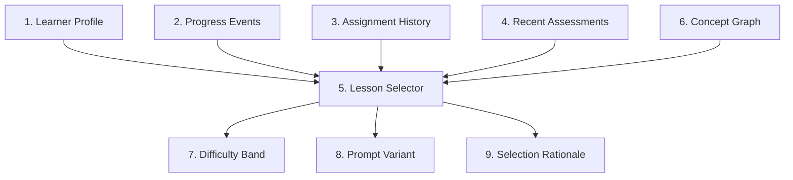

# Rust Sensei Adaptive Lessons LLD

## 1. Overview / Summary

This document defines how Rust Sensei adapts lessons based on learner performance.

The target curriculum is a concept graph. The implemented v1 curriculum is an ordered concept model with prompt variants, rubric ids, learner commands, branch target metadata, prerequisites, competencies, baseline tasks, stretch signals, struggle signals, next concepts, and completion thresholds. Selection policy use of the richer graph metadata can expand incrementally.

Primary requirement links:

- `FR-01`: Initial Rust level selects the starting point.
- `FR-02`: Demonstrated work updates skill estimates.
- `FR-03`: Rust and general programming skill are separate.
- `FR-05`: Lessons adapt using simplify, repeat, continue, accelerate, or branch.
- `FR-06`: General Rust fluency is the default path.
- `NFR-05`: Coaching tone adapts with learner skill.

## 2. Functional Requirements

- `AL-FR-01`: The curriculum must be stored as structured concept specs. The implemented v1 shape is structured and versioned, with graph metadata loaded and validated even where selection policy use remains conservative.
- `AL-FR-02`: Concept specs should define prerequisite concept ids when applicable.
- `AL-FR-03`: Concept specs should define baseline competency criteria when applicable.
- `AL-FR-04`: Concept specs should define stretch signals when applicable.
- `AL-FR-05`: Concept specs should define struggle signals when applicable.
- `AL-FR-06`: Lesson selection must use learner profile, recent assessments, and confidence.
- `AL-FR-07`: Lesson selection must support `simplify`, `repeat`, `continue`, `accelerate`, and `branch` actions. The current deterministic scorer emits `branch` for high-confidence repeated compiler failures and problem-solving gaps when Rust syntax evidence is strong.
- `AL-FR-08`: Placement handling records provisional skips for earlier concepts when a learner starts as `proficient` or `expert`.
- `AL-FR-09`: Demonstrated mastery may mark a concept complete without assigning all practice variants.
- `AL-FR-10`: The system must record why a lesson was selected.
- `AL-FR-11`: The system must persist assignment history and use it during adaptation.
- `AL-FR-12`: Placement skips are represented as provisional skips, not completed concepts.

## 3. Non-Functional Requirements

- `AL-NFR-01`: Lesson specs must be editable without changing Python service code.
- `AL-NFR-02`: Lesson ids and concept ids must be stable.
- `AL-NFR-03`: Lesson selection must be deterministic for the same learner state and curriculum version.
- `AL-NFR-04`: Adaptive behavior must be explainable through evidence.
- `AL-NFR-05`: Lesson selection should avoid repeating the same prompt text more than 2 times in a row.

## 4. LLD Summary

Adaptive lessons use 4 inputs:

1. Initial Rust placement
2. Concept graph
3. Recent assessments
4. Confidence scores

The lesson service selects a concept, selects a difficulty band, builds a lesson prompt, and returns a next-step rationale.

### 4.1 Concept Spec Model

The target concept graph shape is:

```python
from dataclasses import dataclass
from typing import Literal

Difficulty = Literal["intro", "guided", "standard", "challenge", "advanced"]


@dataclass
class LessonVariantSpec:
    variant_id: str
    difficulty: Difficulty
    prompt_template: str
    success_criteria: list[str]
    hints: list[str]
    lesson_commands: list[dict]
    workspace_artifact_policy: Literal[
        "cargo_binary_package",
        "manual_cargo_project",
    ]


@dataclass
class ConceptSpec:
    concept_id: str
    title: str
    order: int
    prerequisites: list[str]
    default_difficulty: Difficulty
    competency_goals: list[str]
    baseline_task: str
    learner_command: str | None
    stretch_signals: list[str]
    struggle_signals: list[str]
    rubric_ids: list[str]
    variants: list[LessonVariantSpec]
    next_concepts: list[str]
    branch_targets: dict[str, list[str]]
    completion_thresholds: dict[str, float]
```

The implemented v1 `Concept` shape supports the graph metadata fields while lesson selection still uses a conservative subset of them:

```python
@dataclass(frozen=True)
class LessonVariant:
    variant_id: str
    difficulty: str
    prompt: str
    success_criteria: list[str]
    hints: list[str]
    lesson_commands: list[LessonCommand]
    workspace_artifact_policy: str


@dataclass(frozen=True)
class Concept:
    concept_id: str
    title: str
    order: int
    prerequisites: list[str]
    default_difficulty: str
    competency_goals: list[str]
    baseline_task: str | None
    learner_command: str | None
    stretch_signals: list[str]
    struggle_signals: list[str]
    rubric_ids: list[str]
    variants: list[LessonVariant]
    next_concepts: list[str]
    branch_targets: dict[str, list[str]]
    completion_thresholds: dict[str, float]
```

The selection decision shape remains:

```python
@dataclass
class CurriculumSpec:
    curriculum_version: str
    branch_fallbacks: dict[str, list[str]]
    concepts: list[ConceptSpec]


@dataclass
class LessonSelectionDecision:
    concept: Concept
    variant: LessonVariant
    selection_rationale: str
    branch_id: str | None
```

`LessonSelectionDecision` is an internal pre-assignment object. The lesson service maps it to the persisted `LessonAssignment`, which owns assignment id, lesson id, concept id, difficulty, variant id, assignment status, timestamps, curriculum version, learner id, and selection rationale.

### 4.2 Example Curriculum Spec

```json
{
  "curriculum_version": "0.1.0",
  "branch_fallbacks": {
    "compiler_feedback_remediation": ["cargo_hello_world"],
    "problem_solving_enrichment": ["traits_generics_testing"]
  },
  "concepts": [
    {
      "concept_id": "variables_primitive_types",
      "title": "Variables And Primitive Types",
      "order": 20,
      "prerequisites": ["cargo_hello_world"],
      "default_difficulty": "guided",
      "competency_goals": [
        "Declare immutable variables",
        "Use string, integer, float, boolean, and char values",
        "Print values with println!",
        "Recognize type inference"
      ],
      "baseline_task": "Create and print 3 variables with different primitive types.",
      "learner_command": "cargo run",
      "stretch_signals": [
        "Uses meaningful variable names",
        "Adds more than 3 appropriate types",
        "Explains inferred types correctly",
        "Keeps output readable"
      ],
      "struggle_signals": [
        "Cannot compile a basic variable declaration",
        "Confuses string literals and String",
        "Uses unclear names",
        "Does not run cargo command"
      ],
      "rubric_ids": [
        "rust_correctness",
        "rust_idioms",
        "readability",
        "compiler_error_handling"
      ],
      "next_concepts": ["mutability_shadowing"],
      "branch_targets": {
        "compiler_feedback_remediation": ["compiler_errors_basic"],
        "problem_solving_enrichment": ["variables_small_problem"]
      },
      "completion_thresholds": {
        "rust_correctness": 0.70,
        "rust_idioms": 0.60,
        "readability": 0.60
      },
      "variants": [
        {
          "variant_id": "variables_primitive_types_guided_001",
          "difficulty": "guided",
          "prompt_template": "Create and print 3 variables with different primitive types.",
          "success_criteria": [
            "Program compiles with cargo run",
            "At least 3 primitive values are declared and printed"
          ],
          "hints": [
            "Start with immutable let bindings",
            "Use println! for each value"
          ],
          "lesson_commands": [
            {
              "command": "cargo run",
              "purpose": "Run the learner's program",
              "risk_level": "low",
              "required": true,
              "allowed_for_agent_verification": true
            }
          ]
        }
      ]
    }
  ]
}
```

### 4.3 Difficulty Bands

| Band | Use when | Example variables task |
| --- | --- | --- |
| `intro` | Learner is new or struggling | Declare 1 integer and print it |
| `guided` | Learner needs structured practice | Declare 3 variables of different types |
| `standard` | Learner shows expected progress | Build a small profile output from typed variables |
| `challenge` | Learner exceeds baseline | Add formatting, mutation, and a small calculation |
| `advanced` | Learner shows strong transfer | Model typed data and explain tradeoffs |

### 4.4 Selection Handler Registry

Lesson selection must use a handler registry instead of a central conditional chain. This keeps next-action behavior extensible without requiring class-per-action complexity in v1. Adding a new action should require adding 1 handler function and registering it, not editing every selection call site.

```python
from collections.abc import Callable


LessonHandler = Callable[["LessonSelectionContext"], LessonSelectionDecision]


def select_simplified_lesson(context: "LessonSelectionContext") -> LessonSelectionDecision:
    concept = context.curriculum.concepts[context.last_assignment.concept_id]
    variant = variant_for_difficulty(
        concept=concept,
        difficulty=lower_difficulty(context.last_assignment.difficulty),
        prior_assignments=context.prior_assignments,
    )
    return LessonSelectionDecision(
        concept=concept,
        variant=variant,
        selection_rationale=(
            "Selected by simplify action after assessment: "
            f"{context.last_assessment.next_action_reason}"
        ),
    )


class LessonSelector:
    def __init__(self, handlers: dict[str, LessonHandler]):
        self.handlers = handlers

    def select_next_lesson(self, context: "LessonSelectionContext") -> LessonSelectionDecision:
        handler = self.handlers.get(context.last_assessment.next_action)
        if handler is None:
            return select_repeat_variant(context)
        return handler(context)
```

Required v1 handlers:

| Action | Handler | Selection behavior |
| --- | --- | --- |
| `simplify` | `select_simplified_lesson` | Same concept, lower difficulty |
| `repeat` | `select_repeat_variant` | Same concept, same difficulty, new variant |
| `continue` | `select_next_concept` | Next concept, default difficulty adjusted by recent score and confidence |
| `accelerate` | `select_accelerated_concept` | Next unmastered concept, challenge difficulty |
| `branch` | `select_branch_lesson` | Branch target selected from assessment evidence |

The `LessonSelector` should be the only service that resolves `next_action` to behavior.

`LessonSelectionContext.last_assessment` reads the persisted flat assessment fields: `next_action`, `branch_id`, and `next_action_reason`. The selector may adapt those fields into a local helper object if useful, but no persisted `next_step_decision` object exists in v1.

### 4.5 Starting Placement

| Initial level | Starting concept | Initial difficulty |
| --- | --- | --- |
| `new` | `cargo_hello_world` | `intro` |
| `beginner` | `variables_primitive_types` | `guided` |
| `intermediate` | `ownership_borrowing_intro` | `standard` |
| `proficient` | `traits_generics_testing` | `challenge` |
| `expert` | `advanced_design_review` | `advanced` |

Placement skip behavior:

- Target behavior: concepts before the starting concept are marked `provisionally_skipped`.
- Target behavior: provisionally skipped concepts are not treated as completed.
- Target behavior: each provisional skip creates a `provisionally_skipped` progress event.
- Target behavior: confirming a skip creates a `skip_confirmed` progress event.
- Target behavior: later assessment evidence may confirm the skip or reopen the concept.
- Target behavior: reopening a skipped concept creates a `reopened` progress event.
- Current v1 behavior: `start_session` records `provisionally_skipped` progress events in the same JSON transaction as profile creation when `proficient` or `expert` placement starts beyond earlier concepts.

### 4.6 Next-Step Rule Set

Target next-step action selection should use ordered rules instead of a hardcoded conditional chain. The first matching rule wins. New action types or thresholds should be added by changing rule data or adding a rule object.

Current v1 deterministic scoring uses ordered next-step rules and emits `repeat`, `simplify`, `continue`, `accelerate`, or high-confidence remediation/enrichment `branch` actions. Branch resolution is implemented in lesson selection for stored branch assessments.

Specific branch and remediation rules must run before broad low-score rules.

```python
from dataclasses import dataclass
from typing import Callable


@dataclass(frozen=True)
class NextStepRule:
    rule_id: str
    action: str
    branch_id: str | None
    predicate: Callable[["AssessmentSummary"], bool]
    reason: str


NEXT_STEP_RULES = [
    NextStepRule(
        rule_id="compiler_feedback_branch",
        action="branch",
        branch_id="compiler_feedback_remediation",
        predicate=lambda a: (
            a.compiler_error_handling_score < 0.50
            and a.recent_compile_failures >= 2
            and a.confidence >= 0.80
        ),
        reason="Repeated compiler-error struggles have high-confidence evidence for targeted remediation.",
    ),
    NextStepRule(
        rule_id="problem_solving_branch",
        action="branch",
        branch_id="problem_solving_enrichment",
        predicate=lambda a: (
            a.rust_score >= 0.70
            and a.problem_solving_score < 0.55
            and a.confidence >= 0.80
        ),
        reason="Rust syntax is progressing faster than problem-solving skill with high-confidence evidence.",
    ),
    NextStepRule(
        rule_id="low_confidence_repeat",
        action="repeat",
        branch_id=None,
        predicate=lambda a: a.confidence < 0.45,
        reason="Assessment confidence is below 0.45.",
    ),
    NextStepRule(
        rule_id="rust_gap_simplify",
        action="simplify",
        branch_id=None,
        predicate=lambda a: a.rust_score < 0.50,
        reason="Rust concept score is below 0.50.",
    ),
    NextStepRule(
        rule_id="strong_performance_accelerate",
        action="accelerate",
        branch_id=None,
        predicate=lambda a: (
            a.rust_score >= 0.85
            and a.general_programming_score >= 0.80
            and a.confidence >= 0.80
        ),
        reason="Rust, general programming, and confidence scores meet acceleration thresholds.",
    ),
    NextStepRule(
        rule_id="expected_progress_continue",
        action="continue",
        branch_id=None,
        predicate=lambda a: a.rust_score >= 0.70 and a.confidence >= 0.60,
        reason="Rust score and confidence meet continuation thresholds.",
    ),
]


def choose_next_action(assessment: "AssessmentSummary") -> tuple[str, str | None, str]:
    for rule in NEXT_STEP_RULES:
        if rule.predicate(assessment):
            return rule.action, rule.branch_id, rule.reason

    return "repeat", None, "No higher-priority rule matched."
```

Thresholds are v1 defaults. They should be tuned after at least 20 assessed attempts from real usage.

Branch target semantics:

- `branch_targets` keys are stable `branch_id` values.
- A next-step rule returning `branch` must also return a `branch_id`.
- Branch rules must satisfy the confidence gating policy before returning `branch`; lower-confidence remediation should use `repeat` or `simplify`.
- The assessment result must persist the selected `branch_id` and next-action reason.
- `select_branch_lesson` resolves the branch by looking up `concept.branch_targets[branch_id]`.
- If the current concept does not define the selected `branch_id`, `select_branch_lesson` uses `curriculum.branch_fallbacks[branch_id]` when configured.
- If no concept branch target or global fallback exists, the selector falls back to `repeat` and records an explicit rationale.
- Branches may be remediation, enrichment, or temporary alternate paths. The branch id defines the branch purpose.

### 4.7 Mastery And Completion Rules

Concept completion is based on rubric scores and confidence.

Default v1 completion rules:

- A standard concept is complete when all required rubric dimensions meet the concept threshold and each required dimension has confidence at least `0.60`.
- A challenge-level attempt can complete the concept when Rust correctness is at least `0.85`, general programming score is at least `0.80`, and overall confidence is at least `0.70`.
- A completed concept can be reopened if later evidence shows a required rubric dimension below `0.50` with confidence at least `0.60`.
- Reopened concepts return through the normal selection handler registry.

Current v1 writes the canonical `assessed` event plus one adaptive outcome event during the same assessment transaction: `completed`, `repeated`, `simplified`, `accelerated`, or `branched`. Reopening remains target behavior and should emit a `reopened` progress event when implemented.

### 4.8 Assignment History And Prompt Variants

Lesson selection uses persisted assignment history.

- `get_next_lesson` creates a `LessonAssignment` when a new instructional decision is made.
- Reopening the current active assignment records `assignment_viewed`, not `assignment_created`.
- Repeat detection and prompt-variation logic use `assignment_created` events only.
- Each assignment includes `assignment_id`, `lesson_id`, `concept_id`, `difficulty`, `variant_id`, `selection_rationale`, and `curriculum_version`.
- Variant selection must be deterministic from stable inputs such as learner id, concept id, difficulty, curriculum version, and repeat count.
- The same `variant_id` should not be assigned more than 2 times in a row for the same concept and difficulty.
- Current implementation selects the first unused variant for the target concept and difficulty from the learner's prior assignments.
- If all matching variants have been used, current implementation falls back to the first matching variant.

Variant exhaustion behavior:

- Prefer a variant not used in the last 2 created assignments for the same concept and difficulty.
- If all variants were used recently and confidence is below `0.45`, ask for missing evidence or repeat with the least recent variant.
- If all variants were used recently and the learner is struggling, lower difficulty before reusing a variant.
- If reuse is unavoidable, allow reuse only with an explicit selection rationale.

Variants are stored on the implemented v1 `Concept.variants` field. A future implementation may move them to a separate lesson spec repository keyed by concept id and difficulty.

### 4.9 Curriculum Validation

Curriculum validation runs at server startup.

Current v1 required checks:

- All concept ids are unique.
- All branch target ids exist.
- All rubric ids are known.
- Every variant id is unique within a concept and stable within a curriculum version.
- Every variant uses a known workspace artifact policy.
- Every variant references valid command metadata for non-allowlisted commands.

Target richer graph checks:

- All prerequisite ids exist.
- All next concept ids exist.
- Every `branch_id` returned by a branch-capable next-step rule is available on relevant concepts or has a configured global fallback.
- The default path has no unintended cycles.
- Every non-terminal concept has at least 1 reachable next concept or branch target.
- Lesson ids and variant ids are stable within a curriculum version.

## 5. LLD Diagram



Diagram description:

1. Learner Profile: Initial placement and current skill model.
2. Progress Events: Append-only history of instructional state changes.
3. Assignment History: Created and viewed lesson assignments.
4. Recent Assessments: Latest rubric scores and next actions.
5. Lesson Selector: Service that chooses the next concept and difficulty.
6. Concept Graph: Structured curriculum data.
7. Difficulty Band: Intro, guided, standard, challenge, or advanced.
8. Prompt Variant: Deterministic lesson variant selected for this assignment.
9. Selection Rationale: Explanation of why the lesson was selected.

## 6. User Perspective Flow

1. The learner answers the initial Rust level question.
2. Rust Sensei selects a starting concept and difficulty.
3. The learner completes the assignment.
4. Rust Sensei assesses the attempt.
5. Rust Sensei updates concept scores and confidence.
6. Rust Sensei picks one next-step action.
7. In current v1, the next prompt is easier, similar, normal, or harder based on evidence.
8. Current deterministic scoring may return a branched prompt for high-confidence compiler remediation evidence or high-confidence problem-solving gap signals.

## 7. Failure Scenarios

### 7.1 Core Path Complete

- Trigger: All core concepts are complete.
- Expected behavior: Return a capstone, project, or review assignment.
- Requirement link: `AL-FR-07`.

### 7.2 Curriculum Graph Invalid

- Trigger: No eligible concept exists because target graph metadata such as prerequisites or graph links are inconsistent.
- Expected behavior: Return a curriculum validation error.
- Requirement link: `AL-FR-02`.

### 7.3 Repeated Prompt Loop

- Trigger: Same lesson text would be returned more than 2 times in a row.
- Expected behavior: Return a new variant or ask for missing evidence.
- Requirement link: `AL-NFR-05`.

### 7.4 Initial Placement Is Wrong

- Trigger: Learner-selected level conflicts with demonstrated work.
- Expected behavior: Update confidence and adjust difficulty.
- Requirement link: `FR-02`.

### 7.5 Assessment Confidence Too Low

- Trigger: Missing code, output, notes, or evidence.
- Expected behavior: Repeat or request more evidence before changing placement.
- Requirement link: `FR-04`.

### 7.6 Concept Spec Invalid

- Trigger: Missing required current fields, invalid rubric ids, duplicate variant ids, invalid command metadata, or invalid graph metadata such as prerequisites, next concept references, and completion thresholds.
- Expected behavior: Fail startup validation and report invalid concept ids.
- Requirement link: `AL-FR-01`.

## Appendix A. Future Changes

### A.1 Future Changes Discussed

- Add specialized tracks after general Rust fluency.
- Add generated exercise variants from the concept graph.
- Add spaced repetition for weak concepts.
- Add project-based capstones after core concepts.
- Add learner-selected goals once baseline fluency is established.
