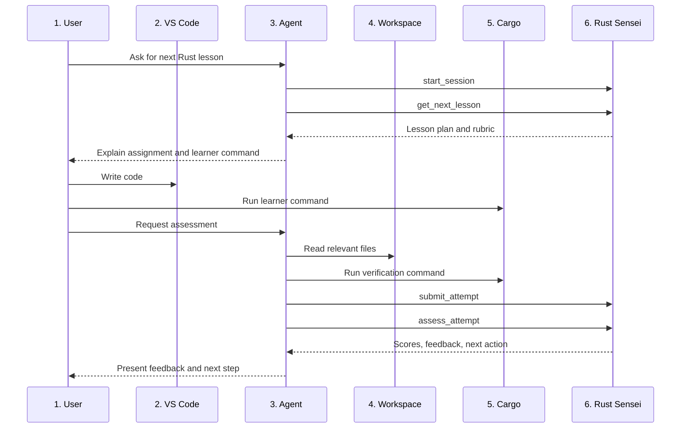

# Rust Sensei AI Agent LLD

## 1. Overview / Summary

This document defines how Codex and future MCP-capable agents use Rust Sensei.

VS Code is the editor. The learner writes code and runs commands in the VS Code terminal. Codex works in the same workspace, calls Rust Sensei through MCP, verifies code when asked, and presents feedback.

Rust Sensei remains agent-neutral. Codex is the v1 documented client, but Claude Code and other agents should use the same MCP tools.

Primary requirement links:

- `FR-07`: Learner-owned execution first, agent-run verification second.
- `FR-08`: Agent sends code and command output to Rust Sensei.
- `FR-12`: MCP server is agent-neutral.
- `NFR-04`: MCP tools, resources, and prompts are client-agnostic.
- `NFR-05`: Feedback is coaching-oriented and adaptive.

## 2. Functional Requirements

- `AA-FR-01`: The agent must open or operate in the same workspace the learner uses in VS Code.
- `AA-FR-02`: The agent must call `start_session` before requesting lessons.
- `AA-FR-03`: The agent must call `get_next_lesson` to retrieve lesson plans.
- `AA-FR-04`: The agent must tell the learner which command to run themselves when the lesson includes `learner_command`.
- `AA-FR-05`: The agent must not skip learner-owned execution unless the learner asks for help or verification.
- `AA-FR-06`: When the learner requests assessment, the agent must read relevant files and run verification commands.
- `AA-FR-07`: The agent must submit code, command output, and notes through `submit_attempt`.
- `AA-FR-08`: The agent must call `assess_attempt` and present the returned feedback.
- `AA-FR-09`: The agent must preserve Rust Sensei as the source of truth for learner state and progression.
- `AA-FR-10`: The agent must not invent skill scores that were not returned by Rust Sensei.

## 3. Non-Functional Requirements

- `AA-NFR-01`: The agent workflow must work from a terminal-based Codex session.
- `AA-NFR-02`: The workflow must not require GitHub Copilot.
- `AA-NFR-03`: The workflow must not require Docker.
- `AA-NFR-04`: Agent-specific setup must stay in documentation or examples.
- `AA-NFR-05`: The agent must keep feedback concise unless the learner asks for deeper explanation.
- `AA-NFR-06`: The agent should ask for missing learner notes only when they would change assessment confidence.

## 4. LLD Summary

The agent acts as a bridge between 3 things:

1. The learner
2. The local Rust workspace
3. Rust Sensei MCP tools

The agent should not own the curriculum or scoring model. It can explain, summarize, and coach, but persisted decisions come from Rust Sensei.

### 4.1 Agent Operating Contract

```text
Agent responsibilities:
  - Start or resume Rust Sensei sessions.
  - Present lesson prompts.
  - Encourage the learner to run commands first.
  - Read local files for assessment.
  - Run verification commands when requested.
  - Submit attempts to Rust Sensei.
  - Present Rust Sensei feedback.

Rust Sensei responsibilities:
  - Track learner state.
  - Select lessons.
  - Score attempts.
  - Choose next-step actions.
  - Store progress.
```

### 4.2 Codex Setup

Codex supports MCP server management through `codex mcp`.

Example local stdio setup:

```bash
codex mcp add rust-sensei -- rust-sensei mcp
codex mcp list
```

If the app-bundled Codex binary is not on `PATH`, use the full binary path or fix the shell profile before running the setup.

### 4.3 Agent System Prompt Snippet

```text
You are using Rust Sensei as the source of truth for Rust lesson progression.

Rules:
1. Call start_session before requesting a lesson.
2. Call get_next_lesson before assigning work.
3. Ask the learner to run the lesson command themselves when provided.
4. Do not assess final performance without submitting the attempt to Rust Sensei.
5. When assessing, collect code, compiler output, runtime output, test output, learner notes, and your notes when available.
6. Present Rust Sensei feedback without inventing additional scores.
7. If the learner is stuck, use update_learner_signal before changing lesson difficulty.
```

### 4.4 Attempt Collection Shape

```python
attempt_payload = {
    "learner_id": "local-default",
    "lesson_id": "variables_primitive_types_001",
    "workspace_root": "/path/to/rust/project",
    "file_paths": ["src/main.rs"],
    "code": "fn main() { ... }",
    "commands_run_by_learner": ["cargo run"],
    "verification_commands_run_by_agent": ["cargo check"],
    "compiler_output": "...",
    "runtime_output": "...",
    "test_output": None,
    "learner_notes": "I was not sure when to use mut.",
    "agent_notes": "The code compiles. Variable names are descriptive."
}
```

### 4.5 Agent Decision Rules

| Situation | Agent action |
| --- | --- |
| New session | Call `start_session` |
| Learner asks what to do next | Call `get_next_lesson` |
| Learner says they are done | Run verification, call `submit_attempt`, then call `assess_attempt` |
| Learner is stuck | Ask 1 focused question or call `update_learner_signal` |
| Code does not compile | Submit compiler output as evidence |
| Rust Sensei returns low confidence | Ask for the missing signal requested by Rust Sensei |

## 5. LLD Diagram



Diagram description:

1. User: Completes lessons and asks for help or assessment.
2. VS Code: Editing environment.
3. Agent: Codex for v1, other MCP clients later.
4. Workspace: Shared local Rust project.
5. Cargo: Command execution environment.
6. Rust Sensei: MCP server and learner state owner.

## 6. User Perspective Flow

1. Open the Rust project in VS Code.
2. Start Codex in the project root.
3. Ask Codex for the next Rust Sensei lesson.
4. Codex gets the lesson from Rust Sensei.
5. Code the assignment in VS Code.
6. Run the requested command in the VS Code terminal.
7. Ask Codex to check the work.
8. Codex reads the code and runs verification.
9. Codex submits the attempt to Rust Sensei.
10. Codex explains the assessment result and next step.

## 7. Failure Scenarios

### 7.1 Agent Is Not In The Workspace

- Trigger: Codex starts outside the Rust project root.
- Expected behavior: Agent asks the learner to switch to the correct directory.
- Requirement link: `AA-FR-01`.

### 7.2 Learner Did Not Run The Command

- Trigger: The learner requests assessment without running the lesson command.
- Expected behavior: Agent may still verify, but should record that learner-owned execution is missing.
- Requirement link: `FR-07`.

### 7.3 Verification Command Fails

- Trigger: `cargo check`, `cargo run`, or `cargo test` fails.
- Expected behavior: Agent submits the failure output to Rust Sensei.
- Requirement link: `FR-08`.

### 7.4 Agent Cannot Read Files

- Trigger: Files are outside the agent workspace or permissions block access.
- Expected behavior: Agent asks for pasted code and command output.
- Requirement link: `FR-08`.

### 7.5 Agent Adds Unsupported Feedback

- Trigger: Agent invents scores or changes the next-step action.
- Expected behavior: Treat as agent behavior bug. Rust Sensei remains source of truth.
- Requirement link: `AA-FR-10`.

## Appendix A. Future Changes

### A.1 Future Changes Discussed

- Add Claude Code setup examples using the same MCP tool contract.
- Add Cursor or other MCP client setup examples.
- Add VS Code task snippets for common Cargo commands.
- Add debugger practice instructions once lessons reach debugging concepts.
- Add current-file submission helpers if a client supports editor context directly.
