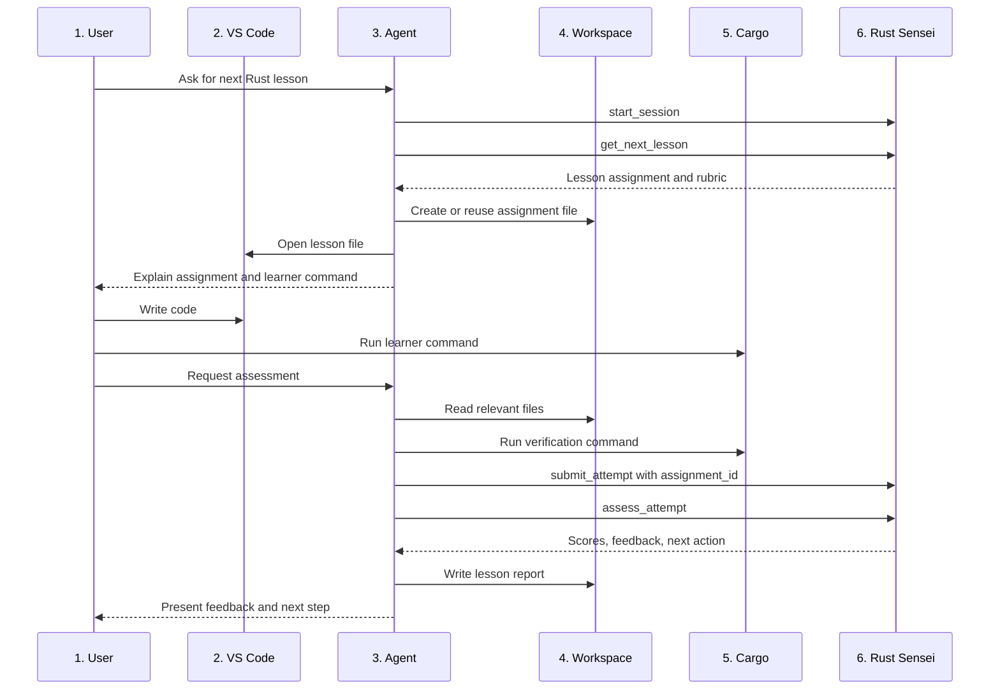

# Rust Sensei AI Agent LLD

## 1. Overview / Summary

This document defines how Codex and future MCP-capable agents use Rust Sensei.

VS Code is the editor. The learner writes code and runs commands in the VS Code terminal. Codex works in the same workspace, calls Rust Sensei through MCP, verifies code when asked, and presents feedback.

Rust Sensei remains agent-neutral. Codex is the v1 documented client, but Claude Code and other agents should use the same MCP tools.

Primary requirement links:

- `FR-07`: Learner-owned execution first, agent-run verification second.
- `FR-08`: Agent sends code and command output to Rust Sensei.
- `FR-12`: MCP server is agent-neutral.
- `NFR-04`: MCP tools, resources, and prompts are client-agnostic.
- `NFR-05`: Feedback is coaching-oriented and adaptive.

## 2. Functional Requirements

- `AA-FR-01`: The agent must open or operate in the same workspace the learner uses in VS Code.
- `AA-FR-02`: The agent must call `start_session` before requesting lessons.
- `AA-FR-03`: The agent must call `get_next_lesson` to retrieve lesson plans.
- `AA-FR-04`: The agent must tell the learner which command to run themselves when the lesson includes `learner_command`.
- `AA-FR-05`: The agent must not skip learner-owned execution unless the learner asks for help or verification.
- `AA-FR-06`: When the learner requests assessment, the agent must read relevant files and run verification commands.
- `AA-FR-07`: The agent must submit code, command output, and notes through `submit_attempt`.
- `AA-FR-08`: The agent must call `assess_attempt` and present the returned feedback.
- `AA-FR-09`: The agent must preserve Rust Sensei as the source of truth for learner state and progression.
- `AA-FR-10`: The agent must not invent skill scores that were not returned by Rust Sensei.
- `AA-FR-11`: The agent must ask the Rust placement question only when Rust Sensei returns `placement_required: true`.
- `AA-FR-12`: The agent must run verification commands only when the learner requests verification or when the lesson explicitly calls for them.
- `AA-FR-13`: For each active assignment, the agent should create or reuse lesson workspace artifacts and open the appropriate file or directory in VS Code, except when the lesson explicitly teaches project setup such as `cargo new`.
- `AA-FR-14`: After `assess_attempt`, the agent should write a lesson report file that summarizes the assignment, submitted artifacts, Rust Sensei scores, confidence, feedback, and next action.

## 3. Non-Functional Requirements

- `AA-NFR-01`: The agent workflow must work from a terminal-based Codex session.
- `AA-NFR-02`: The workflow must not require GitHub Copilot.
- `AA-NFR-03`: The workflow must not require Docker.
- `AA-NFR-04`: Agent-specific setup must stay in documentation or examples.
- `AA-NFR-05`: The agent must keep feedback concise unless the learner asks for deeper explanation.
- `AA-NFR-06`: The agent should ask for missing learner notes only when they would change assessment confidence.

## 4. LLD Summary

The agent acts as a bridge between 3 things:

1. The learner
2. The local Rust workspace
3. Rust Sensei MCP tools

The agent should not own the curriculum or scoring model. It can explain, summarize, and coach, but persisted decisions come from Rust Sensei.

### 4.1 Generic MCP Agent Contract

```text
Agent responsibilities:
  - Start or resume Rust Sensei sessions.
  - Ask the placement question only when Rust Sensei requires it.
  - Present lesson prompts.
  - Create or reuse a lesson-specific file and open it in VS Code.
  - Encourage the learner to run commands first.
  - Read local files for assessment.
  - Run verification commands when requested.
  - Submit attempts to Rust Sensei.
  - Present Rust Sensei feedback.
  - Write learner-readable lesson reports after assessment.

Rust Sensei responsibilities:
  - Track learner state.
  - Select lessons.
  - Score attempts.
  - Choose next-step actions.
  - Store progress.
```

### 4.2 Placement Handling

The agent must follow the server placement protocol.

1. Call `start_session`.
2. If the response includes `placement_required: true`, ask exactly 1 placement prompt with these choices: `new`, `beginner`, `intermediate`, `proficient`, `expert`.
3. Call `start_session` again with the selected value.
4. Do not ask the placement question again once Rust Sensei returns an existing profile.
5. If the learner gives an invalid value, treat correction as validation handling for the same placement prompt. Ask them to choose one of the allowed values without creating a new label.

### 4.3 Verification Command Policy

Agent verification commands execute learner code or inspect learner code, so they are allowed verification commands, not safe commands.

Allowed v1 verification commands:

- `cargo check`
- `cargo run`
- `cargo test`
- `cargo fmt --check` if formatting assessment is enabled

Rules:

- Run commands from the lesson's active Cargo package root. For generated lesson artifacts, this is normally the per-assignment package directory such as `./rust-sensei-lessons/assign_000001/`; for lessons that practice `cargo new`, this is the package directory the learner created.
- Run `cargo run` or `cargo test` only when the learner asks for verification or the lesson explicitly calls for it.
- Use a timeout. Default timeout is 30 seconds for `cargo check` and 60 seconds for `cargo run` or `cargo test`.
- Do not run destructive commands.
- Do not run commands unrelated to the Rust project.
- If a lesson needs another command, Rust Sensei must return it explicitly in the lesson plan.
- Lesson-provided commands are eligible for agent verification only when the command is allowlisted or the lesson marks it `allowed_for_agent_verification: true`.
- Non-allowlisted lesson commands require clear lesson metadata, including `purpose` and `risk_level`.
- Non-allowlisted lesson commands require learner confirmation before execution.
- Destructive commands remain disallowed for v1 even if a lesson includes them.

### 4.4 Lesson Workspace Artifacts

The agent owns local editor and filesystem ergonomics for lessons. Rust Sensei remains the source of truth for assignment ids, lesson selection, attempts, assessments, and progression decisions, but it should not directly control VS Code.

Required agent behavior:

1. After `get_next_lesson` returns an assignment, derive a stable per-assignment workspace directory.
2. Prefer the returned `workspace_suggestion` when present. It uses relative paths such as `./rust-sensei-lessons/assign_000001/` so the agent can anchor them inside the learner workspace or a fallback workspace.
3. If no suitable project workspace is available, use a dedicated local fallback such as `~/rust-sensei-workspace/lessons/assign_000001/`.
4. Create a buildable assignment workspace before presenting the coding task, unless the lesson explicitly asks the learner to practice project creation.
5. For normal single-file beginner lessons, create a minimal Cargo package in the assignment directory with `Cargo.toml` and `src/main.rs`.
6. When a lesson explicitly requires practicing `cargo new`, do not pre-create the Cargo package. Instead, create or open the parent lesson directory, tell the learner the expected package name/path, and let the learner run the setup command.
7. Run learner and agent Cargo commands from the assignment package root, not from the repository root or only the `src/` directory.
8. Open the lesson file in VS Code or the active editor when the client environment supports it.
9. Reuse the same assignment directory and file when the active assignment is reused. Do not overwrite learner code for an existing assignment without confirmation.
10. Include generated lesson file paths in `submit_attempt.file_paths` and read those files when collecting assessment evidence.

Implementation note: `rust_sensei.agent_workflow.prepare_agent_lesson` and `build_submit_attempt_request` provide this composition for Python-based agent integrations. The opener is caller-provided so VS Code control remains an agent/client action, not MCP server behavior.

Codex-oriented example glue lives in `examples/codex_agent_workflow.py`. It keeps `workspace_root` out of submitted attempts by default, opens VS Code only when the caller opts in, and expects command evidence to be collected by the agent before `submit_attempt`.

Recommended artifact layout:

```text
rust-sensei-lessons/
  assign_000001/
    Cargo.toml
    src/
      main.rs
    report.md
```

`report.md` is written only after assessment. It is a user-facing artifact, not canonical state.

### 4.5 Lesson Report Artifact

After `assess_attempt`, the agent should write a Markdown report next to the lesson files.

Report contents should include:

- Assignment id, concept id, difficulty, and lesson prompt.
- Lesson source file path and relevant submitted file paths.
- Learner-run commands and agent verification commands.
- Assessment status, rubric scores, confidence, and confidence explanations exactly as returned by Rust Sensei.
- Feedback items, missing evidence, and next action exactly as returned by Rust Sensei.
- Clearly separated optional agent guidance.

The report filename should be stable for the assignment, normally `report.md`. Regenerating a report for the same assessment may overwrite the previous report; regenerating after a new assessment should preserve the canonical assessment data from Rust Sensei.

Implementation note: `rust_sensei.agent_workflow.write_agent_lesson_report` writes the report next to the prepared workspace using the canonical `assess_attempt` result and the submitted attempt evidence.

### 4.6 Codex Setup

Codex supports MCP server management through `codex mcp`.

The Python helper example for Codex clients is `examples/codex_agent_workflow.py`.

Example local stdio setup:

```bash
codex mcp add rust-sensei -- rust-sensei mcp
codex mcp list
```

This command shape matches the installed Codex CLI help: `codex mcp add <NAME> -- <COMMAND>...`. If the app-bundled Codex binary is not on `PATH`, use the full binary path or fix the shell profile before running the setup.

### 4.7 Agent System Prompt Snippet

```text
You are using Rust Sensei as the source of truth for Rust lesson progression.

Rules:
1. Call start_session before requesting a lesson.
2. Ask the placement question only when start_session returns placement_required: true.
3. Call get_next_lesson before assigning work.
4. Create or reuse lesson workspace artifacts and open the appropriate file or directory in VS Code when possible, except when the lesson explicitly teaches project setup such as cargo new.
5. Ask the learner to run the lesson command themselves when provided.
6. Do not assess final performance without submitting the attempt to Rust Sensei.
7. When assessing, collect assignment id, relevant code when available, learner-run commands, agent verification commands, command metadata, compiler output, runtime output, test output, truncation status, omitted files, learner notes, and your notes when available.
8. Preserve Rust Sensei scores, confidence, evidence, and next-step action exactly.
9. Write a lesson report after assessment and keep optional agent guidance separate from Rust Sensei results.
10. If you add extra advice, label it as agent guidance and do not change progression.
11. If the learner is stuck, use update_learner_signal before changing lesson difficulty.
```

### 4.8 Attempt Collection Shape

```python
attempt_payload = {
    "learner_id": "local-default",
    "assignment_id": "assign_01HX...",
    "workspace_root": "/path/to/rust/project",
    "file_paths": ["src/main.rs"],
    "code": "fn main() { ... }",
    "commands_run_by_learner": ["cargo run"],
    "learner_execution_missing": False,
    "learner_execution_notes": None,
    "verification_commands_run_by_agent": ["cargo check"],
    "command_run_metadata": [
        {
            "command": "cargo check",
            "source": "agent",
            "cwd": ".",
            "exit_code": 0,
            "started_at": "2026-05-10T18:00:00Z",
            "duration_ms": 842,
            "timed_out": False,
            "timeout_ms": 30000,
            "output_summary": "cargo check completed successfully",
            "output_truncated": False,
            "stdout_truncated": False,
            "stderr_truncated": False,
            "purpose": "verify compilation",
            "risk_level": "low"
        }
    ],
    "compiler_output": "...",
    "runtime_output": "...",
    "test_output": None,
    "output_truncated": False,
    "truncation_reason": None,
    "omitted_files": [],
    "learner_notes": "I was not sure when to use mut.",
    "agent_notes": "The code compiles. Variable names are descriptive."
}
```

Payload guidance:

- Prefer relevant files over entire workspaces.
- Prefer paths relative to the workspace root.
- Treat `workspace_root` as optional diagnostic context. Prefer a redacted label or stable hash if exported logs may leave the machine.
- Do not submit secrets, environment files, credentials, or unrelated source files.
- Truncate large command output with an explicit truncation marker.
- Agent notes are diagnostic context. They are not canonical assessment results.

Learner execution behavior:

- If the lesson includes a learner command and the learner has not run it, remind them to run it first.
- If the learner still requests assessment, run allowed verification commands and set `learner_execution_missing: true`.
- Submit the learner's explanation in `learner_execution_notes` when available.

### 4.9 Feedback Rephrasing Rules

- The agent may summarize feedback in learner-friendly language.
- The agent must preserve scores, confidence, evidence, and next-step action exactly.
- The agent must not invent rubric scores.
- Extra advice must be separated from Rust Sensei assessment.
- Extra advice must not change learner progression.

### 4.10 Agent Decision Rules

| Situation | Agent action |
| --- | --- |
| New session | Call `start_session` |
| Rust Sensei returns `placement_required: true` | Ask exactly 1 placement question using allowed choices |
| Learner asks what to do next | Call `get_next_lesson` |
| Rust Sensei returns an active assignment | Create or reuse the assignment workspace file and open it in VS Code |
| Learner says they finished editing | Ask whether they are ready for assessment before running verification |
| Learner asks for assessment or checking | Run verification, call `submit_attempt`, then call `assess_attempt` |
| Rust Sensei returns assessment output | Write or update the assignment `report.md` and present feedback |
| Learner is stuck | Ask 1 focused question or call `update_learner_signal` |
| Code does not compile | Submit compiler output as evidence |
| Rust Sensei returns low confidence | Ask for the missing signal requested by Rust Sensei |

## 5. LLD Diagram



Diagram description:

1. User: Completes lessons and asks for help or assessment.
2. VS Code: Editing environment.
3. Agent: Codex for v1, other MCP clients later.
4. Workspace: Shared local Rust project.
5. Cargo: Command execution environment.
6. Rust Sensei: MCP server and learner state owner.

## 6. User Perspective Flow

1. Open the Rust project in VS Code.
2. Start Codex in the project root.
3. Ask Codex for the next Rust Sensei lesson.
4. Codex gets the lesson from Rust Sensei.
5. Codex creates or reuses the lesson file and opens it in VS Code.
6. Code the assignment in the opened file.
7. Run the requested command in the VS Code terminal.
8. Ask Codex to check the work.
9. Codex reads the code and runs verification.
10. Codex submits the attempt to Rust Sensei.
11. Codex writes the lesson report.
12. Codex explains the assessment result and next step.

## 7. Failure Scenarios

### 7.1 Agent Is Not In The Workspace

- Trigger: Codex starts outside the Rust project root.
- Expected behavior: Agent asks the learner to switch to the correct directory.
- Requirement link: `AA-FR-01`.

### 7.2 Learner Did Not Run The Command

- Trigger: The learner requests assessment without running the lesson command.
- Expected behavior: Agent may still verify, but must send `learner_execution_missing: true` and must not claim command practice occurred.
- Requirement link: `FR-07`.

### 7.3 Verification Command Fails

- Trigger: `cargo check`, `cargo run`, or `cargo test` fails.
- Expected behavior: Agent submits the failure output to Rust Sensei.
- Requirement link: `FR-08`.

### 7.4 Agent Cannot Read Files

- Trigger: Files are outside the agent workspace or permissions block access.
- Expected behavior: Agent asks for pasted code and command output.
- Requirement link: `FR-08`.

### 7.5 Agent Adds Unsupported Feedback

- Trigger: Agent invents scores or changes the next-step action.
- Expected behavior: Treat as agent behavior bug. Rust Sensei remains source of truth.
- Requirement link: `AA-FR-10`.

### 7.6 Verification Command Not Allowed

- Trigger: A requested command is outside the allowed verification command list and was not provided by Rust Sensei.
- Expected behavior: Agent does not run the command and asks for explicit learner approval or a revised lesson command.
- Requirement link: `AA-FR-12`.

## Appendix A. Future Changes

### A.1 Future Changes Discussed

- Add Claude Code setup examples using the same MCP tool contract.
- Add Cursor or other MCP client setup examples.
- Add VS Code task snippets for common Cargo commands.
- Add debugger practice instructions once lessons reach debugging concepts.
- Add current-file submission helpers if a client supports editor context directly.
- Add MCP response fields for suggested assignment workspace paths if server-owned path planning becomes necessary.
