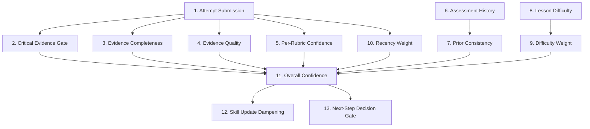

# Rust Sensei Confidence Measuring LLD

## 1. Overview / Summary

This document defines how Rust Sensei measures confidence in learner assessment and progression decisions.

Confidence is not the same as skill. Skill estimates describe how well the learner appears to understand a concept or programming dimension. Confidence describes how much evidence Rust Sensei has for that estimate.

Primary requirement links:

- `FR-02`: Update skill estimates from demonstrated work.
- `FR-03`: Track Rust and general programming skill separately.
- `FR-04`: Each rubric dimension produces score, confidence, and evidence.
- `FR-05`: Next-step action uses scores and confidence.
- `NFR-05`: Feedback adapts to learner skill and confidence.

## 2. Functional Requirements

- `CM-FR-01`: Every rubric score must include a confidence value from `0.0` to `1.0`.
- `CM-FR-02`: Every assessment result must include an overall confidence value from `0.0` to `1.0`.
- `CM-FR-03`: Confidence must be based on evidence completeness, evidence quality, recency, consistency, and task difficulty.
- `CM-FR-04`: Missing code or command output must reduce confidence.
- `CM-FR-05`: Conflicting evidence must reduce confidence.
- `CM-FR-06`: Higher difficulty tasks may increase confidence when completed successfully.
- `CM-FR-07`: Low confidence must limit how much skill estimates change.
- `CM-FR-08`: Low confidence must cause Rust Sensei to request more evidence when the next-step decision would otherwise be large.
- `CM-FR-09`: Confidence calculations must be explainable in the assessment result.
- `CM-FR-10`: Critical evidence gates must cap confidence before weighted averaging.
- `CM-FR-11`: Confidence must be computed per rubric dimension before computing overall confidence.

## 3. Non-Functional Requirements

- `CM-NFR-01`: Confidence values must be deterministic for the same input.
- `CM-NFR-02`: Confidence formulas must be simple enough to inspect in code.
- `CM-NFR-03`: v1 must not use hidden model-only confidence.
- `CM-NFR-04`: Confidence changes must be persisted with assessment records.
- `CM-NFR-05`: Confidence thresholds must be constants in one module.

## 4. LLD Summary

Rust Sensei uses confidence to decide how strongly to trust an assessment.

The v1 confidence model has 5 factors:

1. Evidence completeness
2. Evidence quality
3. Consistency with prior assessments
4. Task difficulty
5. Recency

Each factor is scored from `0.0` to `1.0`. Per-rubric confidence is computed first. Overall confidence is derived from rubric confidence values and shared attempt-level confidence.

### 4.1 Confidence Data Model

```python
from dataclasses import dataclass


@dataclass
class ConfidenceBreakdown:
    critical_evidence_cap: float | None
    evidence_completeness: float
    evidence_quality: float
    prior_consistency: float
    task_difficulty_weight: float
    recency_weight: float
    rubric_confidences: dict[str, float]
    overall: float
    explanation: list[str]
```

### 4.2 Critical Evidence Gates

Critical evidence gates run before weighted confidence.

Concrete primary artifacts:

- Submitted code
- Compiler output
- Runtime output
- Test output
- Persisted command-run metadata containing command, source, exit code, timestamp, truncation status, and either output summary or linked compiler, runtime, or test output

Agent notes do not satisfy critical evidence gates by themselves. Agent notes may explain missing evidence or raise confidence slightly inside a rubric-specific calculation.

```python
def has_primary_command_metadata(attempt) -> bool:
    if not attempt.command_run_metadata:
        return False

    has_linked_output = bool(
        attempt.compiler_output or attempt.runtime_output or attempt.test_output
    )
    return any(
        item.command
        and item.source
        and item.exit_code is not None
        and item.started_at
        and (item.output_summary or has_linked_output)
        for item in attempt.command_run_metadata
    )


def critical_evidence_cap(attempt) -> float | None:
    has_code = bool(attempt.code)
    has_primary_execution_artifact = any(
        [
            attempt.compiler_output,
            attempt.runtime_output,
            attempt.test_output,
            has_primary_command_metadata(attempt),
        ]
    )

    if not has_code and not has_primary_execution_artifact:
        return 0.44

    if not has_code:
        return 0.59

    return None
```

Command metadata without output summary or linked output is audit context, not a primary artifact for confidence gates.

### 4.3 Evidence Completeness

| Evidence | Weight |
| --- | ---: |
| Code submitted | 0.35 |
| Compiler output submitted | 0.25 |
| Runtime or test output submitted | 0.15 |
| Learner notes submitted | 0.10 |
| Structured command metadata submitted | 0.10 |
| Assignment id submitted | 0.05 |

```python
def evidence_completeness(attempt) -> float:
    score = 0.0
    score += 0.35 if attempt.code else 0.0
    score += 0.25 if attempt.compiler_output else 0.0
    score += 0.15 if attempt.runtime_output or attempt.test_output else 0.0
    score += 0.10 if attempt.learner_notes else 0.0
    score += 0.10 if attempt.command_run_metadata else 0.0
    score += 0.05 if attempt.assignment_id else 0.0
    return min(score, 1.0)
```

### 4.4 Evidence Quality

Evidence quality measures whether submitted evidence can support an assessment.

```python
def evidence_quality(attempt) -> float:
    quality = 1.0

    if attempt.code and len(attempt.code.strip()) < 20:
        quality -= 0.25

    if attempt.output_truncated and not attempt.truncation_reason:
        quality -= 0.15

    if attempt.compiler_output and not output_relevant_to_lesson(attempt.compiler_output):
        quality -= 0.20

    if evidence_contradicts_agent_notes(attempt):
        quality -= 0.20

    if attempt.learner_notes and len(attempt.learner_notes.strip()) >= 40:
        quality += 0.05

    if attempt.command_run_metadata:
        quality += 0.05

    return max(0.0, min(quality, 1.0))
```

Compiler errors do not reduce evidence quality by default. Compiler errors are primary evidence for compiler-error handling and concept gaps. Evidence quality is reduced for irrelevant, contradictory, unparseable, or unexplained truncated output.

### 4.5 Per-Rubric Confidence

Different rubric dimensions use different evidence.

| Rubric dimension | Strong evidence |
| --- | --- |
| `rust_correctness` | Code, compiler output, test output |
| `rust_idioms` | Code, concept-specific rubric checks |
| `readability` | Code, naming, structure |
| `maintainability` | Code structure, duplication, decomposition |
| `problem_solving` | Code, learner notes, tests, solution approach |
| `dsa` | Algorithm structure, complexity notes, tests |
| `compiler_error_handling` | Compiler output, learner notes, fix attempts |

```python
RUBRIC_EVIDENCE_WEIGHTS = {
    "rust_correctness": {
        "code": 0.40,
        "compiler_output": 0.35,
        "test_output": 0.20,
        "learner_notes": 0.05,
    },
    "rust_idioms": {
        "code": 0.70,
        "compiler_output": 0.10,
        "learner_notes": 0.10,
        "agent_notes": 0.10,
    },
    "readability": {
        "code": 0.80,
        "learner_notes": 0.10,
        "agent_notes": 0.10,
    },
    "maintainability": {
        "code": 0.75,
        "learner_notes": 0.15,
        "agent_notes": 0.10,
    },
    "problem_solving": {
        "code": 0.35,
        "test_output": 0.20,
        "learner_notes": 0.30,
        "agent_notes": 0.15,
    },
    "dsa": {
        "code": 0.40,
        "test_output": 0.20,
        "learner_notes": 0.25,
        "agent_notes": 0.15,
    },
    "compiler_error_handling": {
        "compiler_output": 0.45,
        "learner_notes": 0.35,
        "code": 0.20,
    },
}


def rubric_confidence(attempt, rubric_id: str) -> float:
    weights = RUBRIC_EVIDENCE_WEIGHTS[rubric_id]
    score = 0.0
    for field_name, weight in weights.items():
        if getattr(attempt, field_name, None):
            score += weight
    capped = apply_rubric_evidence_cap(attempt, rubric_id, score)
    return min(capped * evidence_quality(attempt), 1.0)
```

Agent notes can contribute to rubrics such as readability, but they should not outweigh primary artifacts.

Validation rule: every `rubric_id` assigned by a lesson must have an entry in `RUBRIC_EVIDENCE_WEIGHTS`.

Rubric-specific evidence caps:

```python
CODE_DEPENDENT_RUBRICS = {
    "rust_idioms",
    "readability",
    "maintainability",
}


def apply_rubric_evidence_cap(attempt, rubric_id: str, confidence: float) -> float:
    if rubric_id in CODE_DEPENDENT_RUBRICS and not attempt.code:
        return min(confidence, 0.35)

    if rubric_id == "compiler_error_handling" and not attempt.compiler_output:
        return min(confidence, 0.50)

    return confidence
```

### 4.6 Prior Consistency

Prior consistency compares the current result to recent results.

```python
def prior_consistency(current_score: float, recent_scores: list[float]) -> float:
    if not recent_scores:
        return 0.60

    avg = sum(recent_scores) / len(recent_scores)
    delta = abs(current_score - avg)

    if delta <= 0.10:
        return 1.00
    if delta <= 0.25:
        return 0.75
    if delta <= 0.40:
        return 0.50
    return 0.30
```

Large score changes are allowed. Prior consistency contributes to progression confidence, not raw evidence confidence. Rust Sensei uses current-attempt evidence to score the attempt, then uses prior consistency to dampen skill updates and gate aggressive progression decisions such as acceleration.

### 4.7 Task Difficulty Weight

| Difficulty | Weight |
| --- | ---: |
| `intro` | 0.70 |
| `guided` | 0.80 |
| `standard` | 0.90 |
| `challenge` | 1.00 |
| `advanced` | 1.00 |

Higher difficulty tasks provide stronger evidence when the attempt is successful. Failed advanced tasks may still provide useful evidence, but should not cause a large negative update from 1 attempt.

```python
def task_difficulty_weight(difficulty: str, observed_score: float) -> float:
    base = DIFFICULTY_WEIGHTS[difficulty]

    if difficulty in {"challenge", "advanced"} and observed_score < 0.50:
        return 0.75

    if difficulty in {"challenge", "advanced"} and observed_score >= 0.80:
        return 1.00

    return base
```

### 4.8 Recency Weight

For v1, recency is `1.0` for the current attempt. Historical scores older than 30 days should receive a `0.75` weight when computing trend summaries.

### 4.9 Overall Confidence Formula

```python
WEIGHTS = {
    "evidence_completeness": 0.30,
    "evidence_quality": 0.20,
    "rubric_confidence": 0.20,
    "prior_consistency": 0.10,
    "task_difficulty_weight": 0.15,
    "recency_weight": 0.05,
}


def weighted_mean_required_rubrics(
    rubric_confidences: dict[str, float],
    required_rubric_ids: list[str],
    rubric_weights: dict[str, float] | None = None,
) -> float:
    if not required_rubric_ids:
        raise ValueError("required_rubric_ids must not be empty")

    if rubric_weights is None:
        rubric_weights = {rubric_id: 1.0 for rubric_id in required_rubric_ids}

    missing = [
        rubric_id
        for rubric_id in required_rubric_ids
        if rubric_id not in rubric_confidences or rubric_id not in rubric_weights
    ]
    if missing:
        raise ValueError(f"Missing rubric confidence or weight for: {missing}")

    if any(rubric_weights[rubric_id] <= 0 for rubric_id in required_rubric_ids):
        raise ValueError("rubric_weights must be positive")

    numerator = sum(
        rubric_confidences[rubric_id] * rubric_weights[rubric_id]
        for rubric_id in required_rubric_ids
    )
    denominator = sum(rubric_weights[rubric_id] for rubric_id in required_rubric_ids)
    return numerator / denominator


def overall_confidence(
    breakdown: ConfidenceBreakdown,
    required_rubric_ids: list[str],
    rubric_weights: dict[str, float] | None = None,
) -> float:
    rubric_confidence = weighted_mean_required_rubrics(
        breakdown.rubric_confidences,
        required_rubric_ids,
        rubric_weights,
    )
    value = (
        breakdown.evidence_completeness * WEIGHTS["evidence_completeness"]
        + breakdown.evidence_quality * WEIGHTS["evidence_quality"]
        + rubric_confidence * WEIGHTS["rubric_confidence"]
        + breakdown.prior_consistency * WEIGHTS["prior_consistency"]
        + breakdown.task_difficulty_weight * WEIGHTS["task_difficulty_weight"]
        + breakdown.recency_weight * WEIGHTS["recency_weight"]
    )
    bounded = max(0.0, min(value, 1.0))
    if breakdown.critical_evidence_cap is not None:
        bounded = min(bounded, breakdown.critical_evidence_cap)
    return round(bounded, 2)
```

### 4.10 Skill Update Dampening

Confidence controls how much a score can move after 1 assessment.

| Confidence | Maximum score movement |
| --- | ---: |
| `0.00` to `0.44` | `0.05` |
| `0.45` to `0.59` | `0.10` |
| `0.60` to `0.79` | `0.20` |
| `0.80` to `1.00` | `0.30` |

```python
from dataclasses import dataclass


@dataclass(frozen=True)
class ConfidenceBand:
    upper_bound: float
    max_delta: float


CONFIDENCE_BANDS = [
    ConfidenceBand(upper_bound=0.45, max_delta=0.05),
    ConfidenceBand(upper_bound=0.60, max_delta=0.10),
    ConfidenceBand(upper_bound=0.80, max_delta=0.20),
    ConfidenceBand(upper_bound=1.01, max_delta=0.30),
]


def max_delta_for_confidence(confidence: float) -> float:
    if confidence < 0.0 or confidence > 1.0:
        raise ValueError(f"Confidence must be between 0.0 and 1.0: {confidence}")

    for band in CONFIDENCE_BANDS:
        if confidence < band.upper_bound:
            return band.max_delta

    raise AssertionError("Unreachable confidence band")


def update_score(previous: float, observed: float, confidence: float) -> float:
    max_delta = max_delta_for_confidence(confidence)
    delta = observed - previous
    bounded = max(-max_delta, min(delta, max_delta))
    return round(previous + bounded, 2)
```

### 4.11 Decision Thresholds

| Condition | Result |
| --- | --- |
| Overall confidence `< 0.45` | Ask for more evidence or repeat |
| Overall confidence `0.45` to `0.59` | Allow simplify or repeat, allow continue only when scores clearly meet concept thresholds, block acceleration and branch |
| Overall confidence `0.60` to `0.79` | Allow simplify, repeat, continue |
| Overall confidence `>= 0.80` | Allow simplify, repeat, continue, accelerate, branch |

Assessment status mapping:

- If no assessable artifact is present, request validation fails before assessment.
- If overall confidence is below `0.45`, return `assessment_status: "insufficient_evidence"` and skip skill updates.
- If overall confidence is at least `0.45`, return assessed scores with confidence dampening.

Boundary tests must cover `0.44`, `0.45`, `0.59`, `0.60`, `0.79`, and `0.80`.

### 4.12 Worked Examples

| Scenario | Expected confidence behavior |
| --- | --- |
| Full evidence, standard task, consistent history | Overall confidence should usually be at least `0.75` |
| Missing code but has compiler output and learner notes | Overall confidence is capped at `0.59` |
| Strong challenge attempt after weak history | Skill update is dampened, and acceleration requires confidence at least `0.80` |
| Agent notes conflict with compiler output | Evidence quality is reduced and the contradiction appears in the explanation |

## 5. LLD Diagram



Diagram description:

1. Attempt Submission: Code, outputs, notes, and lesson context.
2. Critical Evidence Gate: Caps confidence when primary artifacts are missing.
3. Evidence Completeness: Checks which evidence fields are present.
4. Evidence Quality: Checks whether evidence is relevant, complete, and non-contradictory.
5. Per-Rubric Confidence: Computes confidence separately for each rubric dimension.
6. Assessment History: Recent prior scores.
7. Prior Consistency: Measures agreement with recent evidence.
8. Lesson Difficulty: Difficulty band for the attempted lesson.
9. Difficulty Weight: Evidence strength from task difficulty and performance direction.
10. Recency Weight: Current or historical timing weight.
11. Overall Confidence: Weighted confidence value after critical evidence caps.
12. Skill Update Dampening: Limits score movement.
13. Next-Step Decision Gate: Restricts acceleration or branching when confidence is low.

## 6. User Perspective Flow

1. The learner submits an attempt through the agent.
2. Rust Sensei checks whether the attempt includes code, command output, and notes.
3. Rust Sensei scores the attempt.
4. Rust Sensei computes confidence for each rubric dimension.
5. Rust Sensei computes overall confidence.
6. Rust Sensei updates skill scores using confidence dampening.
7. Rust Sensei chooses a next-step action.
8. If confidence is low, Rust Sensei asks for more evidence or returns a repeat-style lesson.

## 7. Failure Scenarios

### 7.1 Missing Code

- Trigger: Attempt has no submitted code.
- Expected behavior: Overall confidence is capped at `0.59` when a primary execution artifact exists and capped at `0.44` when both code and primary execution artifacts are missing.
- Requirement link: `CM-FR-04`.

### 7.2 Missing Command Output

- Trigger: No compiler, runtime, or test output.
- Expected behavior: Evidence completeness loses at least `0.25`.
- Requirement link: `CM-FR-04`.

### 7.3 Conflicting Evidence

- Trigger: Agent notes say the code compiles, but compiler output contains errors.
- Expected behavior: Evidence quality or internal consistency is reduced.
- Requirement link: `CM-FR-05`.

### 7.4 One Strong Attempt After Weak History

- Trigger: Current score is more than `0.40` above recent average.
- Expected behavior: Prior consistency becomes `0.30`, limiting score movement.
- Requirement link: `CM-FR-07`.

### 7.5 Low Confidence But High Score

- Trigger: Observed score is high but confidence is below `0.45`.
- Expected behavior: Do not accelerate. Ask for more evidence or repeat with a variant.
- Requirement link: `CM-FR-08`.

## Appendix A. Future Changes

### A.1 Future Changes Discussed

- Tune thresholds after 20 or more real assessed attempts.
- Expand per-rubric confidence formulas.
- Add spaced repetition confidence decay by concept.
- Add calibration reports that compare predicted difficulty to learner outcomes.
- Add optional model-assisted confidence explanation, while keeping formula output as source of truth.
