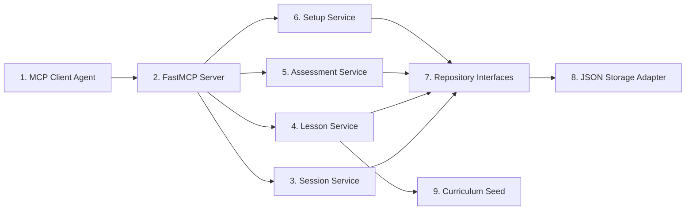

# Rust Sensei MCP Server LLD

## 1. Overview / Summary

This document defines the low-level design for the Rust Sensei MCP server.

The server is a Python application that exposes MCP tools, resources, and prompts. It stores learner state locally, selects adaptive lessons, assesses submitted attempts, and returns structured coaching data to the calling agent.

The server must not execute arbitrary learner Rust code in v1. The agent runs workspace commands and sends the resulting context to the server.

Primary requirement links:

- `FR-01`: Ask exactly 1 initial Rust placement question.
- `FR-02`: Update skill estimates from demonstrated work.
- `FR-03`: Track Rust skill and general programming skill separately.
- `FR-04`: Assess work with rubric dimensions.
- `FR-05`: Return adaptive next-step actions.
- `FR-08`: Accept code and command output from the agent.
- `FR-09`: Store state in local JSON for v1.
- `FR-10`: Abstract persistence.
- `FR-12`: Keep MCP surface agent-neutral.
- `NFR-01`: Use Python.
- `NFR-06`: Do not execute learner code inside the server.

## 2. Functional Requirements

- `MS-FR-01`: The server must expose a `start_session` tool.
- `MS-FR-02`: The server must expose a `get_next_lesson` tool.
- `MS-FR-03`: The server must expose a `submit_attempt` tool.
- `MS-FR-04`: The server must expose an `assess_attempt` tool.
- `MS-FR-05`: The server must expose a `get_learner_profile` tool.
- `MS-FR-06`: The server must expose a `get_progress_summary` tool.
- `MS-FR-07`: The server must expose an `update_learner_signal` tool.
- `MS-FR-08`: The server must expose a `get_setup_status` tool.
- `MS-FR-09`: The server must expose read-only MCP resources for active profile, progress summary, and curriculum concepts.
- `MS-FR-10`: The server must expose MCP prompts for tutor behavior, attempt review, and stuck-state coaching.
- `MS-FR-11`: The server must use repository interfaces for persistence.
- `MS-FR-12`: The server must validate all tool inputs before updating state.
- `MS-FR-13`: The server must use atomic JSON writes for state updates.

## 3. Non-Functional Requirements

- `MS-NFR-01`: Python version target is 3.11 or newer.
- `MS-NFR-02`: The implementation should use the official MCP Python SDK.
- `MS-NFR-03`: The default transport should be stdio for local agent use.
- `MS-NFR-04`: The server must support offline use after dependencies are installed.
- `MS-NFR-05`: Tool return values must be structured JSON-compatible objects.
- `MS-NFR-06`: Validation errors must not update learner state.
- `MS-NFR-07`: Direct JSON access must be limited to storage adapter modules.

## 4. LLD Summary

The MCP server has 6 implementation areas:

1. MCP interface layer
2. Application services
3. Domain models
4. Repositories
5. JSON storage adapter
6. CLI entrypoint

The MCP interface layer converts tool calls into service calls. Application services contain session, curriculum, assessment, and setup logic. Domain models define typed inputs and outputs. Repositories define persistence boundaries. The JSON adapter implements those repositories for v1. The CLI entrypoint starts the MCP server and later supports `doctor`.

### 4.1 Package Layout

```text
rust_sensei/
  __init__.py
  __main__.py
  cli.py
  mcp_server.py
  domain/
    models.py
    scoring.py
    curriculum.py
  services/
    session_service.py
    lesson_service.py
    assessment_service.py
    setup_service.py
  repositories/
    interfaces.py
    json_repository.py
  prompts/
    tutor_prompts.py
  resources/
    curriculum_seed.json
```

### 4.2 MCP Tools

| Tool | Side effect | Purpose |
| --- | --- | --- |
| `start_session` | Yes | Create or resume the active learner session |
| `get_next_lesson` | No | Return the next adaptive lesson |
| `submit_attempt` | Yes | Persist a learner attempt |
| `assess_attempt` | Yes | Score an attempt and update learner state |
| `get_learner_profile` | No | Return profile and skill estimates |
| `get_progress_summary` | No | Return current path and progress |
| `update_learner_signal` | Yes | Record a non-code learner signal |
| `get_setup_status` | No | Return local setup status |

### 4.3 Data Models

```python
from dataclasses import dataclass, field
from datetime import datetime
from enum import Enum
from typing import Literal

RustLevel = Literal["new", "beginner", "intermediate", "proficient", "expert"]
NextAction = Literal["simplify", "repeat", "continue", "accelerate", "branch"]


@dataclass
class SkillScore:
    score: float
    confidence: float
    evidence: list[str] = field(default_factory=list)


@dataclass
class SkillModel:
    rust_concepts: dict[str, SkillScore]
    programming_dimensions: dict[str, SkillScore]


@dataclass
class LearnerProfile:
    learner_id: str
    rust_level_initial: RustLevel | None
    active_concept_id: str | None
    skill_model: SkillModel
    created_at: datetime
    updated_at: datetime


@dataclass
class LessonPlan:
    lesson_id: str
    concept_id: str
    prompt: str
    success_criteria: list[str]
    learner_command: str | None
    hints: list[str]
    rubric_ids: list[str]


@dataclass
class AttemptSubmission:
    attempt_id: str
    learner_id: str
    lesson_id: str
    code: str
    file_paths: list[str]
    compiler_output: str | None
    runtime_output: str | None
    test_output: str | None
    learner_notes: str | None
    agent_notes: str | None
    submitted_at: datetime


@dataclass
class AssessmentResult:
    assessment_id: str
    attempt_id: str
    rubric_scores: dict[str, SkillScore]
    next_action: NextAction
    feedback_summary: str
    confidence: float
    created_at: datetime
```

### 4.4 Repository Interfaces

```python
from typing import Protocol


class LearnerRepository(Protocol):
    def get_active_profile(self) -> LearnerProfile | None: ...
    def save_profile(self, profile: LearnerProfile) -> None: ...


class AttemptRepository(Protocol):
    def save_attempt(self, attempt: AttemptSubmission) -> None: ...
    def get_attempt(self, attempt_id: str) -> AttemptSubmission | None: ...
    def list_recent_attempts(self, learner_id: str, limit: int) -> list[AttemptSubmission]: ...


class AssessmentRepository(Protocol):
    def save_assessment(self, result: AssessmentResult) -> None: ...
    def list_recent_assessments(self, learner_id: str, limit: int) -> list[AssessmentResult]: ...


class CurriculumRepository(Protocol):
    def get_concept(self, concept_id: str) -> ConceptSpec | None: ...
    def list_concepts(self) -> list[ConceptSpec]: ...
```

### 4.5 JSON State Shape

```json
{
  "schema_version": 1,
  "active_learner_id": "local-default",
  "learners": {
    "local-default": {
      "learner_id": "local-default",
      "rust_level_initial": "new",
      "active_concept_id": "cargo_hello_world",
      "skill_model": {
        "rust_concepts": {},
        "programming_dimensions": {}
      },
      "created_at": "2026-05-10T00:00:00Z",
      "updated_at": "2026-05-10T00:00:00Z"
    }
  },
  "attempts": [],
  "assessments": [],
  "signals": []
}
```

### 4.6 FastMCP Server Skeleton

```python
from mcp.server.fastmcp import FastMCP

from rust_sensei.services.session_service import SessionService
from rust_sensei.services.lesson_service import LessonService
from rust_sensei.services.assessment_service import AssessmentService

mcp = FastMCP("rust-sensei")

session_service = SessionService(...)
lesson_service = LessonService(...)
assessment_service = AssessmentService(...)


@mcp.tool()
def start_session(initial_rust_level: str | None = None) -> dict:
    """Create or resume the active Rust Sensei learner session."""
    return session_service.start_session(initial_rust_level)


@mcp.tool()
def get_next_lesson(learner_id: str = "local-default") -> dict:
    """Return the next adaptive Rust lesson for the learner."""
    return lesson_service.get_next_lesson(learner_id)


@mcp.tool()
def submit_attempt(payload: dict) -> dict:
    """Persist a learner attempt for later assessment."""
    return assessment_service.submit_attempt(payload)


@mcp.tool()
def assess_attempt(attempt_id: str) -> dict:
    """Assess an attempt and update learner state."""
    return assessment_service.assess_attempt(attempt_id)


if __name__ == "__main__":
    mcp.run()
```

The skeleton is illustrative. The implementation should use typed request and response models where the SDK version supports structured output.

## 5. LLD Diagram



Diagram description:

1. MCP Client Agent: Codex or another MCP client.
2. FastMCP Server: Tool, resource, and prompt registration layer.
3. Session Service: Creates or resumes the learner session.
4. Lesson Service: Selects the next adaptive lesson.
5. Assessment Service: Persists attempts and computes assessment results.
6. Setup Service: Reports local prerequisite status.
7. Repository Interfaces: Stable persistence contracts.
8. JSON Storage Adapter: v1 local storage implementation.
9. Curriculum Seed: Structured starter concept graph.

## 6. User Perspective Flow

1. The learner asks Codex to start Rust Sensei.
2. Codex calls `start_session`.
3. If no profile exists, Rust Sensei asks for the initial Rust level.
4. Codex calls `get_next_lesson`.
5. Rust Sensei returns a lesson plan and rubric.
6. The learner completes the lesson in VS Code.
7. Codex calls `submit_attempt` with code and command output.
8. Codex calls `assess_attempt`.
9. Rust Sensei stores the assessment and updates learner state.
10. Codex presents feedback and the next step.

## 7. Failure Scenarios

### 7.1 Invalid Tool Input

- Trigger: Required fields are missing or invalid.
- Expected behavior: Return validation errors and do not update state.
- Requirement link: `MS-FR-12`.

### 7.2 JSON Write Failure

- Trigger: State path is not writable or atomic replace fails.
- Expected behavior: Return a storage error and preserve the previous state file.
- Requirement link: `MS-FR-13`.

### 7.3 State Schema Version Unsupported

- Trigger: JSON `schema_version` is higher than the server supports.
- Expected behavior: Refuse writes and report the unsupported version.
- Requirement link: `FR-10`.

### 7.4 Unknown Lesson Or Attempt

- Trigger: `lesson_id` or `attempt_id` does not exist.
- Expected behavior: Return a not-found error and do not update learner state.
- Requirement link: `FR-08`.

### 7.5 MCP Client Disconnects

- Trigger: Client exits during a tool call.
- Expected behavior: Complete no partial state write unless the write already succeeded atomically.
- Requirement link: `NFR-09`.

## Appendix A. Future Changes

### A.1 Future Changes Discussed

- Add SQLite adapter behind the same repository interfaces.
- Add hosted Postgres adapter for multi-user deployment.
- Add streamable HTTP transport for remote or web-based clients.
- Add a sandboxed code runner as a separate service, not as part of the default MCP assessment path.
- Add richer MCP resources for curriculum browsing.
- Add migrations for JSON schema changes.
