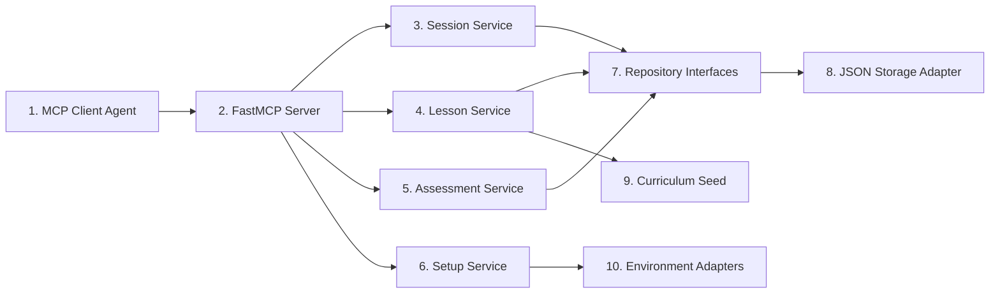

# Rust Sensei MCP Server LLD

## 1. Overview / Summary

This document defines the low-level design for the Rust Sensei MCP server.

The server is a Python application that exposes MCP tools, resources, and prompts. It stores learner state locally, selects adaptive lessons, assesses submitted attempts, and returns structured coaching data to the calling agent.

The server must not execute arbitrary learner Rust code in v1. The agent runs workspace commands and sends the resulting context to the server.

Primary requirement links:

- `FR-01`: Ask exactly 1 initial Rust placement question.
- `FR-02`: Update skill estimates from demonstrated work.
- `FR-03`: Track Rust skill and general programming skill separately.
- `FR-04`: Assess work with rubric dimensions.
- `FR-05`: Return adaptive next-step actions.
- `FR-08`: Accept code and command output from the agent.
- `FR-09`: Store state in local JSON for v1.
- `FR-10`: Abstract persistence.
- `FR-12`: Keep MCP surface agent-neutral.
- `NFR-01`: Use Python.
- `NFR-06`: Do not execute learner code inside the server.

## 2. Functional Requirements

- `MS-FR-01`: The server must expose a `start_session` tool.
- `MS-FR-02`: The server must expose a `get_next_lesson` tool.
- `MS-FR-03`: The server must expose a `submit_attempt` tool.
- `MS-FR-04`: The server must expose an `assess_attempt` tool.
- `MS-FR-05`: The server must expose a `get_learner_profile` tool.
- `MS-FR-06`: The server must expose a `get_progress_summary` tool.
- `MS-FR-07`: The server must expose an `update_learner_signal` tool.
- `MS-FR-08`: The server must expose a `get_setup_status` tool.
- `MS-FR-09`: The server must expose read-only MCP resources for active profile, progress summary, and curriculum concepts.
- `MS-FR-10`: The server must expose MCP prompts for tutor behavior, attempt review, and stuck-state coaching.
- `MS-FR-11`: The server must use repository interfaces for persistence.
- `MS-FR-12`: The server must validate all tool inputs before updating state.
- `MS-FR-13`: The server must use atomic JSON writes for state updates.
- `MS-FR-14`: The server must generate canonical ids for assignments, attempts, assessments, and progress events.
- `MS-FR-15`: The server must persist `LessonAssignment` records when it creates new lesson assignments.
- `MS-FR-16`: `get_next_lesson` must return an active unattempted assignment by default.
- `MS-FR-17`: `assess_attempt` must be idempotent for the same `attempt_id`.
- `MS-FR-18`: The server must expose typed request and response contracts for each MCP tool.
- `MS-FR-19`: The assessment service must isolate scorer implementation details behind a provider boundary so deterministic v1 scoring can later be replaced or augmented without changing MCP tool schemas.

## 3. Non-Functional Requirements

- `MS-NFR-01`: Python version target is 3.11 or newer.
- `MS-NFR-02`: The implementation should use the official MCP Python SDK.
- `MS-NFR-03`: The default transport should be stdio for local agent use.
- `MS-NFR-04`: The server must support offline use after dependencies are installed.
- `MS-NFR-05`: Tool return values must be structured JSON-compatible objects.
- `MS-NFR-06`: Validation errors must not update learner state.
- `MS-NFR-07`: Direct JSON access must be limited to storage adapter modules.
- `MS-NFR-08`: Request validation should use Pydantic or an equivalent runtime validation layer.
- `MS-NFR-09`: JSON writes must use atomic replace plus a single-writer lock around read-modify-write operations.

## 4. LLD Summary

The MCP server has 6 implementation areas:

1. MCP interface layer
2. Application services
3. Domain models
4. Repositories
5. JSON storage adapter
6. CLI entrypoint

The MCP interface layer converts tool calls into service calls. Application services contain session, curriculum, assessment, and setup logic. Domain models define typed inputs and outputs. Repositories define persistence boundaries. The JSON adapter implements those repositories for v1. The CLI entrypoint starts the MCP server and later supports `doctor`.

### 4.1 Package Layout

```text
rust_sensei/
  __init__.py
  __main__.py
  cli.py
  mcp_server.py
  domain/
    models.py
    scoring.py
    curriculum.py
  services/
    session_service.py
    lesson_service.py
    assessment_service.py
    setup_service.py
  repositories/
    interfaces.py
    json_repository.py
  prompts/
    tutor_prompts.py
  resources/
    curriculum_seed.json
```

### 4.2 MCP Tools

| Tool | Side effect | Purpose |
| --- | --- | --- |
| `start_session` | Yes | Create or resume the active learner session |
| `get_next_lesson` | Yes | Return an active assignment or create a new lesson assignment |
| `submit_attempt` | Yes | Persist a learner attempt |
| `assess_attempt` | Yes | Score an attempt and update learner state |
| `get_learner_profile` | No | Return profile and skill estimates |
| `get_progress_summary` | No | Return current path and progress |
| `update_learner_signal` | Yes | Record a non-code learner signal |
| `get_setup_status` | No | Return local setup status |

### 4.3 MCP Resources And Prompts

Resources:

| URI | Dynamic | Purpose |
| --- | --- | --- |
| `rust-sensei://profile/active` | Yes | Active learner profile for `local-default` |
| `rust-sensei://progress/summary` | Yes | Derived progress summary and recent events |
| `rust-sensei://curriculum/concepts` | No | Curriculum concept inventory |

Prompts:

| Prompt | Purpose |
| --- | --- |
| `rust_sensei_tutor` | General tutor behavior and coaching boundaries |
| `rust_sensei_attempt_review` | Review an attempt using Rust Sensei assessment output |
| `rust_sensei_stuck_coaching` | Coach a learner who is blocked or confused |

### 4.4 Tool Contracts

Tool inputs and outputs should be implemented as Pydantic models. The server should not expose loose `dict` payloads except at the MCP SDK boundary.

```python
from typing import Literal

from pydantic import BaseModel, Field

RustLevel = Literal["new", "beginner", "intermediate", "proficient", "expert"]
NextAction = Literal["simplify", "repeat", "continue", "accelerate", "branch"]


class ErrorEnvelope(BaseModel):
    error_code: str
    message: str
    details: dict = Field(default_factory=dict)
    retryable: bool = False


class LessonCommandDTO(BaseModel):
    command: str
    purpose: str
    risk_level: Literal["low", "medium", "high"]
    required: bool = True
    allowed_for_agent_verification: bool = False


class StartSessionRequest(BaseModel):
    learner_id: str = "local-default"
    initial_rust_level: RustLevel | None = None


class LearnerProfileDTO(BaseModel):
    learner_id: str
    rust_level_initial: RustLevel | None
    active_concept_id: str | None
    skill_summary: dict[str, float] = Field(default_factory=dict)


class SkillScoreDTO(BaseModel):
    score: float
    confidence: float
    evidence: list[str] = Field(default_factory=list)


class LessonPlanDTO(BaseModel):
    lesson_id: str
    concept_id: str
    prompt: str
    success_criteria: list[str]
    learner_command: str | None = None
    lesson_commands: list[LessonCommandDTO] = Field(default_factory=list)
    hints: list[str] = Field(default_factory=list)
    rubric_ids: list[str]


class LessonAssignmentDTO(BaseModel):
    assignment_id: str
    learner_id: str
    lesson_id: str
    concept_id: str
    difficulty: str
    variant_id: str
    status: Literal["active", "attempted", "assessed", "abandoned"]
    selection_rationale: str
    curriculum_version: str


class CommandRunMetadataDTO(BaseModel):
    command: str
    source: Literal["learner", "agent"]
    cwd: str | None = None
    exit_code: int | None
    started_at: str
    duration_ms: int | None = None
    timed_out: bool = False
    timeout_ms: int | None = None
    output_summary: str | None = None
    output_truncated: bool = False
    stdout_truncated: bool = False
    stderr_truncated: bool = False
    purpose: str | None = None
    risk_level: Literal["low", "medium", "high"] | None = None


class ConfidenceBreakdownDTO(BaseModel):
    critical_evidence_cap: float | None = None
    evidence_completeness: float
    evidence_quality: float
    rubric_confidences: dict[str, float]
    prior_consistency: float
    task_difficulty_weight: float
    recency_weight: float
    overall: float


class FeedbackItemDTO(BaseModel):
    category: str
    message: str
    evidence: list[str] = Field(default_factory=list)


class AssessmentScoringProvenanceDTO(BaseModel):
    scorer_type: Literal["deterministic", "llm", "hybrid"]
    scorer_name: str
    scorer_version: str
    model_provider: str | None = None
    model_name: str | None = None
    model_version: str | None = None


class AssessmentResultDTO(BaseModel):
    assessment_id: str
    attempt_id: str
    assignment_id: str
    scoring_version: str
    scoring_provenance: AssessmentScoringProvenanceDTO | None = None
    assessment_status: Literal["assessed", "insufficient_evidence"]
    rubric_scores: dict[str, SkillScoreDTO]
    confidence_breakdown: ConfidenceBreakdownDTO
    missing_evidence: list[str] = Field(default_factory=list)
    feedback_items: list[FeedbackItemDTO] = Field(default_factory=list)
    next_action: NextAction
    branch_id: str | None = None
    next_action_reason: str
    feedback_summary: str
    confidence: float


class StartSessionResponse(BaseModel):
    learner_id: str
    placement_required: bool
    allowed_placements: list[RustLevel] = Field(default_factory=list)
    profile: LearnerProfileDTO | None = None


class GetNextLessonRequest(BaseModel):
    learner_id: str = "local-default"
    force_new_variant: bool = False
    abandon_active_assignment: bool = False
    abandonment_reason: str | None = None


class GetNextLessonResponse(BaseModel):
    assignment: LessonAssignmentDTO | None
    lesson_plan: LessonPlanDTO | None
    reused_active_assignment: bool
    pending_assessment: bool = False
    pending_attempt_id: str | None = None


class SubmitAttemptRequest(BaseModel):
    learner_id: str = "local-default"
    assignment_id: str
    client_request_id: str | None = None
    client_request_fingerprint: str | None = None
    workspace_root: str | None = None
    code: str | None = None
    file_paths: list[str] = Field(default_factory=list)
    commands_run_by_learner: list[str] = Field(default_factory=list)
    verification_commands_run_by_agent: list[str] = Field(default_factory=list)
    compiler_output: str | None = None
    runtime_output: str | None = None
    test_output: str | None = None
    command_run_metadata: list[CommandRunMetadataDTO] = Field(default_factory=list)
    output_truncated: bool = False
    truncation_reason: str | None = None
    omitted_files: list[str] = Field(default_factory=list)
    learner_notes: str | None = None
    agent_notes: str | None = None
    learner_execution_missing: bool = False
    learner_execution_notes: str | None = None


class SubmitAttemptResponse(BaseModel):
    attempt_id: str
    already_submitted: bool


class AssessAttemptRequest(BaseModel):
    attempt_id: str


class AssessAttemptResponse(BaseModel):
    assessment: AssessmentResultDTO
    already_assessed: bool


class GetLearnerProfileRequest(BaseModel):
    learner_id: str = "local-default"


class GetLearnerProfileResponse(BaseModel):
    profile: LearnerProfileDTO
    skill_model: dict[str, dict[str, SkillScoreDTO]]


class ProgressEventDTO(BaseModel):
    event_id: str
    event_type: str
    assignment_id: str | None = None
    attempt_id: str | None = None
    assessment_id: str | None = None
    details: dict = Field(default_factory=dict)
    created_at: str


class GetProgressSummaryRequest(BaseModel):
    learner_id: str = "local-default"


class GetProgressSummaryResponse(BaseModel):
    learner_id: str
    active_concept_id: str | None
    completed_concepts: list[str] = Field(default_factory=list)
    repeated_concepts: list[str] = Field(default_factory=list)
    skipped_concepts: list[str] = Field(default_factory=list)
    recent_events: list[ProgressEventDTO] = Field(default_factory=list)
    recommended_focus: str | None = None


class UpdateLearnerSignalRequest(BaseModel):
    learner_id: str = "local-default"
    signal_type: Literal[
        "confusion",
        "confidence",
        "blocker",
        "pacing",
        "too_easy",
        "too_hard",
        "boredom",
    ]
    value: str | float | bool
    notes: str | None = None


class UpdateLearnerSignalResponse(BaseModel):
    signal_id: str
    recorded: bool


class SetupCheckDTO(BaseModel):
    check_id: str
    status: str
    message: str


class GetSetupStatusRequest(BaseModel):
    learner_id: str = "local-default"


class GetSetupStatusResponse(BaseModel):
    ready: bool
    checks: list[SetupCheckDTO] = Field(default_factory=list)
```

DTO mapping rule: MCP request and response models are Pydantic DTOs. Domain models may use dataclasses internally. Services must map explicitly between API DTOs and domain models instead of returning raw dataclasses through the MCP boundary.

Validation rule: `assignment_id` is required for `submit_attempt`. At least 1 assessable artifact is also required: code, compiler output, runtime output, test output, or complete command run metadata. Missing code by itself is not a validation error when another assessable artifact exists.

Error strategy: v1 raises MCP tool errors with `ErrorEnvelope` in structured details. Validation and not-found errors are not retryable. Storage conflicts and transient filesystem failures are retryable. Unsupported schema version and invalid JSON state are not retryable until recovery occurs.

Example validation error:

```json
{
  "error_code": "validation_error",
  "message": "assignment_id is required",
  "details": {"field": "assignment_id"},
  "retryable": false
}
```

Example idempotency conflict:

```json
{
  "error_code": "idempotency_conflict",
  "message": "client_request_id was reused with different content",
  "details": {"client_request_id": "req-123"},
  "retryable": false
}
```

Example not-found error:

```json
{
  "error_code": "not_found",
  "message": "assignment_id was not found",
  "details": {"assignment_id": "assign_missing"},
  "retryable": false
}
```

Example storage conflict:

```json
{
  "error_code": "storage_conflict",
  "message": "state revision changed during update",
  "details": {"expected_revision": 10, "actual_revision": 11},
  "retryable": true
}
```

Example unsupported schema version:

```json
{
  "error_code": "unsupported_schema_version",
  "message": "state schema version is newer than this server supports",
  "details": {"schema_version": 2, "supported_schema_version": 1},
  "retryable": false
}
```

### 4.5 Data Models

```python
from dataclasses import dataclass, field
from datetime import datetime
from typing import Literal

RustLevel = Literal["new", "beginner", "intermediate", "proficient", "expert"]
NextAction = Literal["simplify", "repeat", "continue", "accelerate", "branch"]


@dataclass
class SkillScore:
    score: float
    confidence: float
    evidence: list[str] = field(default_factory=list)


@dataclass
class SkillModel:
    rust_concepts: dict[str, SkillScore]
    programming_dimensions: dict[str, SkillScore]


@dataclass
class LearnerProfile:
    learner_id: str
    rust_level_initial: RustLevel | None
    active_concept_id: str | None
    skill_model: SkillModel
    created_at: datetime
    updated_at: datetime


@dataclass
class LessonCommand:
    command: str
    purpose: str
    risk_level: Literal["low", "medium", "high"]
    required: bool
    allowed_for_agent_verification: bool


@dataclass
class LessonPlan:
    lesson_id: str
    concept_id: str
    prompt: str
    success_criteria: list[str]
    learner_command: str | None
    lesson_commands: list[LessonCommand]
    hints: list[str]
    rubric_ids: list[str]


@dataclass
class LessonAssignment:
    assignment_id: str
    learner_id: str
    lesson_id: str
    concept_id: str
    difficulty: str
    variant_id: str
    status: Literal["active", "attempted", "assessed", "abandoned"]
    selection_rationale: str
    next_action_source: str | None
    curriculum_version: str
    created_at: datetime
    updated_at: datetime


@dataclass
class CommandRunMetadata:
    command: str
    source: Literal["learner", "agent"]
    cwd: str | None
    exit_code: int | None
    started_at: datetime
    duration_ms: int | None
    timed_out: bool
    timeout_ms: int | None
    output_summary: str | None
    output_truncated: bool
    stdout_truncated: bool
    stderr_truncated: bool
    purpose: str | None
    risk_level: Literal["low", "medium", "high"] | None


@dataclass
class ConfidenceBreakdown:
    critical_evidence_cap: float | None
    evidence_completeness: float
    evidence_quality: float
    rubric_confidences: dict[str, float]
    prior_consistency: float
    task_difficulty_weight: float
    recency_weight: float
    overall: float


@dataclass
class FeedbackItem:
    category: str
    message: str
    evidence: list[str]


@dataclass
class AttemptSubmission:
    attempt_id: str
    learner_id: str
    assignment_id: str
    lesson_id: str
    client_request_id: str | None
    client_request_fingerprint: str | None
    workspace_root: str | None
    code: str | None
    file_paths: list[str]
    commands_run_by_learner: list[str]
    verification_commands_run_by_agent: list[str]
    compiler_output: str | None
    runtime_output: str | None
    test_output: str | None
    command_run_metadata: list[CommandRunMetadata]
    output_truncated: bool
    truncation_reason: str | None
    omitted_files: list[str]
    learner_notes: str | None
    agent_notes: str | None
    learner_execution_missing: bool
    learner_execution_notes: str | None
    submitted_at: datetime


@dataclass
class AssessmentScoringProvenance:
    scorer_type: Literal["deterministic", "llm", "hybrid"]
    scorer_name: str
    scorer_version: str
    model_provider: str | None
    model_name: str | None
    model_version: str | None


@dataclass
class AssessmentResult:
    assessment_id: str
    attempt_id: str
    assignment_id: str
    scoring_version: str
    scoring_provenance: AssessmentScoringProvenance | None
    assessment_status: Literal["assessed", "insufficient_evidence"]
    rubric_scores: dict[str, SkillScore]
    confidence_breakdown: ConfidenceBreakdown
    missing_evidence: list[str]
    feedback_items: list[FeedbackItem]
    next_action: NextAction
    branch_id: str | None
    next_action_reason: str
    feedback_summary: str
    confidence: float
    created_at: datetime


@dataclass
class ProgressEvent:
    event_id: str
    learner_id: str
    event_type: Literal[
        "assignment_created",
        "assignment_viewed",
        "attempt_submitted",
        "assessed",
        "completed",
        "repeated",
        "simplified",
        "accelerated",
        "branched",
        "provisionally_skipped",
        "skip_confirmed",
        "reopened",
        "abandoned",
    ]
    assignment_id: str | None
    attempt_id: str | None
    assessment_id: str | None
    details: dict
    previous_status: str | None
    new_status: str | None
    created_at: datetime


@dataclass
class LearnerSignal:
    signal_id: str
    learner_id: str
    signal_type: str
    value: str | float | bool
    notes: str | None
    created_at: datetime
```

### 4.6 Repository Interfaces

```python
from typing import Protocol


class LearnerRepository(Protocol):
    def get_active_profile(self) -> LearnerProfile | None: ...
    def save_profile(self, profile: LearnerProfile) -> None: ...


class AssignmentRepository(Protocol):
    def save_assignment(self, assignment: LessonAssignment) -> None: ...
    def get_assignment(self, assignment_id: str) -> LessonAssignment | None: ...
    def get_active_assignment(self, learner_id: str) -> LessonAssignment | None: ...
    def update_assignment(self, assignment: LessonAssignment) -> None: ...


class AttemptRepository(Protocol):
    def save_attempt(self, attempt: AttemptSubmission) -> None: ...
    def get_attempt_by_client_request_id(
        self, learner_id: str, client_request_id: str
    ) -> AttemptSubmission | None: ...
    def get_attempt(self, attempt_id: str) -> AttemptSubmission | None: ...
    def list_recent_attempts(self, learner_id: str, limit: int) -> list[AttemptSubmission]: ...


class AssessmentRepository(Protocol):
    def save_assessment(self, result: AssessmentResult) -> None: ...
    def get_assessment_by_attempt_id(self, attempt_id: str) -> AssessmentResult | None: ...
    def list_recent_assessments(self, learner_id: str, limit: int) -> list[AssessmentResult]: ...


class ProgressEventRepository(Protocol):
    def save_event(self, event: ProgressEvent) -> None: ...
    def list_recent_events(self, learner_id: str, limit: int) -> list[ProgressEvent]: ...


class LearnerSignalRepository(Protocol):
    def save_signal(self, signal: LearnerSignal) -> LearnerSignal: ...
    def list_recent_signals(self, learner_id: str, limit: int) -> list[LearnerSignal]: ...


class CurriculumRepository(Protocol):
    def get_concept(self, concept_id: str) -> ConceptSpec | None: ...
    def list_concepts(self) -> list[ConceptSpec]: ...
```

### 4.7 JSON State Shape

```json
{
  "schema_version": 1,
  "state_revision": 1,
  "active_learner_id": "local-default",
  "learners": {
    "local-default": {
      "learner_id": "local-default",
      "rust_level_initial": "new",
      "active_concept_id": "cargo_hello_world",
      "skill_model": {
        "rust_concepts": {},
        "programming_dimensions": {}
      },
      "created_at": "2026-05-10T00:00:00Z",
      "updated_at": "2026-05-10T00:00:00Z"
    }
  },
  "lesson_assignments": [],
  "attempts": [],
  "assessments": [
    {
      "assessment_id": "assessment_01",
      "attempt_id": "attempt_01",
      "assignment_id": "assignment_01",
      "scoring_version": "deterministic-rubric-v1",
      "scoring_provenance": {
        "scorer_type": "deterministic",
        "scorer_name": "deterministic-rubric",
        "scorer_version": "v1",
        "model_provider": null,
        "model_name": null,
        "model_version": null
      }
    }
  ],
  "progress_events": [],
  "signals": []
}
```

JSON repository rules:

- Lock the state file before load-mutate-write operations.
- Reload state after acquiring the lock.
- Increment `state_revision` for every successful mutation.
- Write to a temporary file, flush it, and atomically replace the prior state file.
- Return a conflict error if a mutation expects a revision that no longer matches.
- `scoring_provenance` is optional for backward-compatible reads of older state, but new assessments should populate it.

### 4.8 Session, Assignment, And Assessment Semantics

- `start_session` with no profile and no placement returns `placement_required: true`.
- `start_session` creates the learner profile only after a valid placement is provided.
- v1 accepts only the active learner id, default `local-default`.
- Requests for unsupported learner ids return validation or not-found errors.
- `get_next_lesson` returns an active unattempted assignment if one exists.
- `get_next_lesson` returns a pending-assessment response when an assignment is attempted but not assessed.
- `get_next_lesson` creates a new assignment only when no active assignment exists, the prior assignment was assessed or abandoned, or `force_new_variant` is true.
- `abandon_active_assignment` requires `abandonment_reason`.
- If `force_new_variant` and `abandon_active_assignment` are both true, the server abandons the active assignment first, records an `abandoned` event, then creates a new assignment.
- If `force_new_variant` is true without abandonment, the server creates a new variant only when this does not violate assignment state invariants.
- Returning an existing assignment records `assignment_viewed`, not `assignment_created`.
- Creating a new assignment records `assignment_created`.
- `submit_attempt` does not accept `attempt_id`; the server generates it.
- `submit_attempt` may accept `client_request_id` and `client_request_fingerprint` for retry-safe submission.
- If the same learner and `client_request_id` arrive with identical fingerprint, return the existing attempt.
- If the same learner and `client_request_id` arrive with different fingerprint, return an idempotency conflict and do not create another attempt.
- `assess_attempt` returns an existing assessment when the attempt was already assessed.
- Canonical assessment is produced by Rust Sensei scoring logic. Agent notes are persisted as evidence or diagnostic context.

Command metadata rule: command metadata counts as a primary artifact only when it is complete: command, source, exit code, timestamp, truncation status, and either output summary or linked compiler, runtime, or test output.

### 4.9 Assessment Scorer Boundary

The v1 scorer may remain deterministic, but the assessment service must depend on a stable scorer interface instead of directly depending on a single scoring strategy. This keeps the `assess_attempt` MCP contract stable if later versions add LLM-assisted code assessment.

```python
class AssessmentScorer(Protocol):
    def score_attempt(
        self,
        attempt: AttemptSubmission,
        concept: Concept,
        difficulty: str,
        now: datetime,
    ) -> AssessmentResult: ...
```

Provider rules:

- `AssessmentService` owns idempotency, repository writes, skill updates, and progress events.
- The scorer provider owns rubric scoring, evidence summaries, confidence, `scoring_version`, `scoring_provenance`, and missing-evidence decisions.
- Deterministic scoring should use a version such as `deterministic-rubric-v1`.
- Future LLM-assisted scoring must populate `scoring_provenance` with model or provider metadata before it is accepted as canonical.
- Agent notes and LLM output are evidence sources, not unvalidated direct state mutations.
- Retrying `assess_attempt` for the same `attempt_id` returns the persisted assessment, even if the scorer implementation or model has changed since the first call.

### 4.10 FastMCP Server Skeleton

```python
from mcp.server.fastmcp import FastMCP

from rust_sensei.services.session_service import SessionService
from rust_sensei.services.lesson_service import LessonService
from rust_sensei.services.assessment_service import AssessmentService
from rust_sensei.services.setup_service import SetupService

mcp = FastMCP("rust-sensei")

session_service = SessionService(...)
lesson_service = LessonService(...)
assessment_service = AssessmentService(...)
setup_service = SetupService(...)


@mcp.tool()
def start_session(payload: dict) -> dict:
    """Create or resume the active Rust Sensei learner session."""
    request = StartSessionRequest.model_validate(payload)
    return session_service.start_session(request).model_dump()


@mcp.tool()
def get_next_lesson(payload: dict) -> dict:
    """Return the next adaptive Rust lesson for the learner."""
    request = GetNextLessonRequest.model_validate(payload)
    return lesson_service.get_next_lesson(request).model_dump()


@mcp.tool()
def submit_attempt(payload: dict) -> dict:
    """Persist a learner attempt for later assessment."""
    request = SubmitAttemptRequest.model_validate(payload)
    return assessment_service.submit_attempt(request).model_dump()


@mcp.tool()
def assess_attempt(payload: dict) -> dict:
    """Assess an attempt and update learner state."""
    request = AssessAttemptRequest.model_validate(payload)
    return assessment_service.assess_attempt(request).model_dump()


@mcp.tool()
def get_learner_profile(payload: dict) -> dict:
    """Return the active learner profile and skill model."""
    request = GetLearnerProfileRequest.model_validate(payload)
    return session_service.get_learner_profile(request).model_dump()


@mcp.tool()
def get_progress_summary(payload: dict) -> dict:
    """Return the learner's progress summary."""
    request = GetProgressSummaryRequest.model_validate(payload)
    return progress_service.get_progress_summary(request).model_dump()


@mcp.tool()
def update_learner_signal(payload: dict) -> dict:
    """Record a non-code learner signal."""
    request = UpdateLearnerSignalRequest.model_validate(payload)
    return session_service.update_learner_signal(request).model_dump()


@mcp.tool()
def get_setup_status(payload: dict) -> dict:
    """Return local setup diagnostics."""
    request = GetSetupStatusRequest.model_validate(payload)
    return setup_service.get_setup_status(request).model_dump()


@mcp.resource("rust-sensei://profile/active")
def active_profile() -> dict:
    """Return the active learner profile."""
    return session_service.get_active_profile().model_dump()


@mcp.resource("rust-sensei://progress/summary")
def progress_summary() -> dict:
    """Return derived learner progress."""
    return progress_service.get_active_progress_summary().model_dump()


@mcp.resource("rust-sensei://curriculum/concepts")
def curriculum_concepts() -> dict:
    """Return the curriculum concept inventory."""
    return lesson_service.list_curriculum_concepts().model_dump()


@mcp.prompt()
def rust_sensei_tutor() -> str:
    return "Use Rust Sensei state and assessments as the source of truth."


@mcp.prompt()
def rust_sensei_attempt_review() -> str:
    return "Review attempts using persisted Rust Sensei assessment output."


@mcp.prompt()
def rust_sensei_stuck_coaching() -> str:
    return "Coach the learner through blockers without changing progression unless Rust Sensei records a signal."


if __name__ == "__main__":
    mcp.run()
```

The skeleton is illustrative. The implementation should use typed request and response models where the SDK version supports structured output.

## 5. LLD Diagram



Diagram description:

1. MCP Client Agent: Codex or another MCP client.
2. FastMCP Server: Tool, resource, and prompt registration layer.
3. Session Service: Creates or resumes the learner session.
4. Lesson Service: Selects the next adaptive lesson.
5. Assessment Service: Persists attempts and computes assessment results.
6. Setup Service: Reports local prerequisite status.
7. Repository Interfaces: Stable persistence contracts.
8. JSON Storage Adapter: v1 local storage implementation.
9. Curriculum Seed: Structured starter concept graph.
10. Environment Adapters: Filesystem, command discovery, Python version, and Cargo availability checks.

## 6. User Perspective Flow

1. The learner asks Codex to start Rust Sensei.
2. Codex calls `start_session`.
3. If no profile exists, Rust Sensei returns `placement_required: true`.
4. Codex asks the learner exactly 1 placement question and calls `start_session` with the selected value.
5. Codex calls `get_next_lesson`.
6. Rust Sensei returns an active assignment or creates a new lesson assignment.
7. The learner completes the lesson in VS Code.
8. Codex calls `submit_attempt` with assignment id, code, and command output.
9. Codex calls `assess_attempt`.
10. Rust Sensei returns the existing assessment for duplicate requests or creates one assessment for the attempt.
11. Codex presents feedback and the next step.

## 7. Failure Scenarios

### 7.1 Invalid Tool Input

- Trigger: Required fields are missing or invalid.
- Expected behavior: Return validation errors and do not update state.
- Requirement link: `MS-FR-12`.

### 7.2 JSON Write Failure

- Trigger: State path is not writable or atomic replace fails.
- Expected behavior: Return a storage error and preserve the previous state file.
- Requirement link: `MS-FR-13`.

### 7.3 State Schema Version Unsupported

- Trigger: JSON `schema_version` is higher than the server supports.
- Expected behavior: Refuse writes and report the unsupported version.
- Requirement link: `FR-10`.

### 7.4 Unknown Assignment Or Attempt

- Trigger: `assignment_id`, `lesson_id`, or `attempt_id` does not exist.
- Expected behavior: Return a not-found error and do not update learner state.
- Requirement link: `FR-08`.

### 7.5 MCP Client Disconnects

- Trigger: Client exits during a tool call.
- Expected behavior: Complete no partial state write unless the write already succeeded atomically.
- Requirement link: `NFR-09`.

### 7.6 Duplicate Lesson Request

- Trigger: Client calls `get_next_lesson` multiple times before submitting an attempt.
- Expected behavior: Return the active assignment and record `assignment_viewed`.
- Requirement link: `MS-FR-16`.

### 7.7 Duplicate Assessment Request

- Trigger: Client retries `assess_attempt` for an already assessed attempt.
- Expected behavior: Return the existing assessment and do not update skill scores again.
- Requirement link: `MS-FR-17`.

## Appendix A. Future Changes

### A.1 Future Changes Discussed

- Add SQLite adapter behind the same repository interfaces.
- Add hosted Postgres adapter for multi-user deployment.
- Add streamable HTTP transport for remote or web-based clients.
- Add a sandboxed code runner as a separate service, not as part of the default MCP assessment path.
- Add richer MCP resources for curriculum browsing.
- Add migrations for JSON schema changes.
